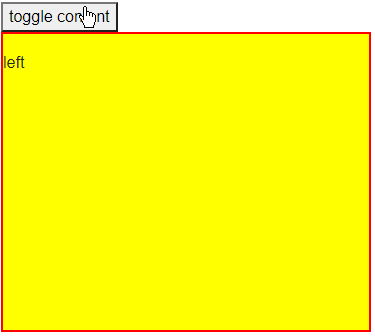

## Description
We want to do some animations to show the flow between some razor components.

I want to change content on my page with an animation.

Something like this:



## Solution

Animations are best done in CSS (such as CSS3 transitions) or JavaScript. Blazor does not do animations in C# very well, because they are a CSS/JavaScript feature and so the C# part can usually react when it starts or ends (for JS), or control its start when it is a CSS transition through a CSS class. Thus, components that animate would usually wait for one animation to end before they can start the next (this is the behavior of `async Task` methods).

>caption Toggle content with CSS animation

````CSHTML
@* Comments in the code offer more details *@

<style>
    /*main layout - uses flex, hides the content on the right from view through overflow*/
    .the-container {
        display: flex;
        flex-direction: row;
        align-items: stretch;
        border: 2px solid red;
        min-height: 300px;
        overflow: hidden;
    }

    /*inner layout - uses widths to show and hide the content in the flex layout*/
        .the-container .expanded {
            width: 100%;
        }

        .the-container .collapsed {
            width: 0%;
        }

        /*animate the width*/
        .the-container .content {
            transition: width 700ms ease-in-out;
        }

        /*just some styling*/
        .the-container .left {
            background: yellow;
        }

        .the-container .right {
            background: green;
        }


</style>

<button @onclick="@( () => Left = !Left )">toggle content</button>

<div class="the-container">
    <div class="@( ( Left ? "expanded" : "collapsed" ) + " content left")">
        @if (Left)
        {
            @* we can use if-blocks to hide components when they are not visible to reduce rendering tree size *@
            @* note that showing them again will initialize them from scratch which could be expensive, depending on the app state and setup *@
            <div>left</div>
        }
    </div>
    <div class="@( ( Left ? "collapsed" : "expanded" ) + " content right" )">
        @if (!Left)
        {
            <div>right</div>
        }
    </div>
</div>

@code {
    bool Left { get; set; } = true;
}
````
