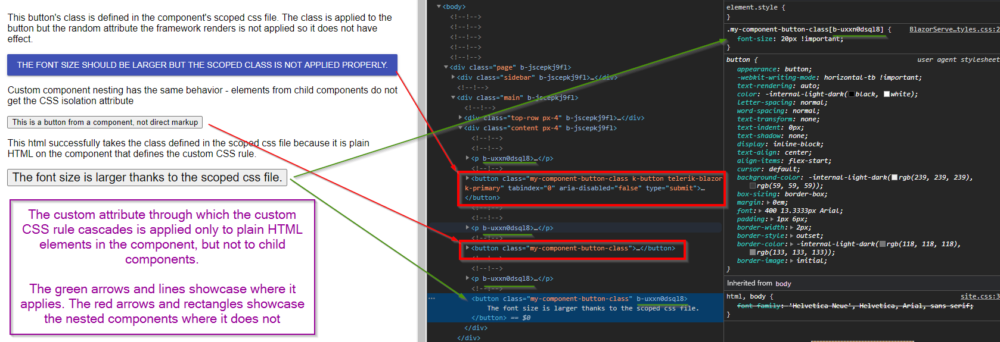

## Description
I'm wanting to leverage CSS isolation in my projects but am finding that it doesn't work with Telerik components.

## Steps to Reproduce

1. Use .NET 5 version that supports CSS isolation (like RC2 at the time of writing).

1. Add a CSS rule to the scoped styles, such as a font size change.

    **CSS**
    
        .my-component-button-class {
            font-size: 20px !important;
        }


1. Apply that class to a Telerik component

````CSHTML
<p>This button's class is defined in the component's scoped css file. The class is applied to the button but the random attribute the framework renders is not applied so it does not have effect.</p>
<TelerikButton Class="my-component-button-class"
               Primary="true">
    The font size should be larger but the scoped class is not applied properly.
</TelerikButton>

<p>Custom component nesting has the same behavior - elements from child components do not get the CSS isolation attribute</p>
<MyCustomComponent Class="my-component-button-class" />


<p>This html successfully takes the class defined in the scoped css file because it is plain HTML on the component that defines the custom CSS rule.</p>
<button class="my-component-button-class">
    The font size is larger thanks to the scoped css file.
</button>
````
````MyCustomComponent
<button class="@Class">
    This is a button from a component, not direct markup
</button>
@code {
    [Parameter]
    public string Class { get; set; }
}
````

**Expected**: The new font size is applied.

**Actual**: The new font size is not applied.

## Cause\Possible Cause(s)

The CSS isolation feature works by adding a random attribute to the DOM elements from the component that defines the isolated CSS rules, and then cascades the CSS rule through that custom attribute.

The problem is that this applies only to plain HTML elements, but it does not apply to child components - be that Telerik components or other components (even those defined by the app itself).

>caption CSS Isolation explained



## Solution

There are two ways to go around this:

* Use CSS rules that are global to the application and not scoped to a particular component through the CSS Isolation feature. You can also use the `Class` parameter of the Telerik components to cascade through it if you want to target particular instances only.

* Use the `::deep` pseudoselector that the framework translates to the random identifier attribute it adds to the DOM in the scoped selectors, and wrap nested components in HTML elements such as `<span>` or `<div>`

>caption Sample CSS selector that uses `::deep` to cascade for nested components

````CSS
.my-component-button-class,
::deep .my-component-button-class {
    font-size: 20px !important;
}
````

>caption Sample way to wrap nested components in HTML elements from the current component so `::deep` rules can affect them

````CSHTML
<p>This button's class is defined in the component's scoped css file. It's applied to the wrapping element from this component (a span in this case, make sure to use an appropriate one to have valid HTML) and the ::deep pseudoselector applies it to the button.</p>
<span>
    <TelerikButton Class="my-component-button-class"
                   Primary="true">
        The font size should be larger but the scoped class is not applied properly.
    </TelerikButton>
</span>

<p>Custom component nesting has the same behavior - elements from child components do not get the CSS isolation attribute but you can also cascade through some HTML element</p>
<div>
    <MyCustomComponent Class="my-component-button-class" />
</div>

<p>This html successfully takes the class defined in the scoped css file because it is plain HTML on the component that defines the custom CSS rule.</p>
<button class="my-component-button-class">
    The font size is larger thanks to the scoped css file.
</button>
````

>important Some components/elements of components (such as Window and the Popup containers of all dropdowns) are not rendered in the place of declaration. Therefore, since they are not actually part of the parent, the above solution will not be applicable for them. You can try using the Class parameter for the components and the PopupClass parameter of the Popup containers to set the desired styling.