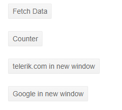

## Environment
<table>
	<tbody>
		<tr>
			<td>Product</td>
			<td>Button for Blazor</td>
		</tr>
	</tbody>
</table>


## Description
Is it possible to use target="_blank" with Telerik Button? I need to open Telerik report in separate browser-tab.

I want to navigate the user to another page when a button is clicked but I do not see a href parameter on it.

## Solution
To use regular (in-app) links from a button, you can use the <a href="https://docs.microsoft.com/en-us/aspnet/core/blazor/fundamentals/routing?view=aspnetcore-5.0#uri-and-navigation-state-helpers" target="_blank">NavigationManager and its NavigateTo method</a> in the click event of the button.

If you also want to open a new tab, you need an anchor element (`<a>`) and to set its `target` attribute to `_blank`. Often you could also achieve that through JavaScript and using `window.open(url)`, but in the context of a Blazor app you might prefer to use less JavaScript.

You can style anchors to look like Telerik buttons through the `k-button` CSS class that comes with the Telerik Themes (example below).

>caption Open a new browser window from a button



````CSHTML
<a class="k-button" href="/fetchdata">Fetch Data</a>
<br /><br />
<NavLink class="k-button" href="/counter">Counter</NavLink>
<br /><br />
<a class="k-button" target="_blank" href="https://www.telerik.com">telerik.com in new window</a>
<br /><br />
<NavLink class="k-button" target="_blank" href="https://www.google.com">Google in new window</NavLink>
````

