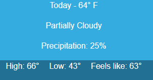

I want to make grid and stack layouts like in XAML (WPF, Xamarin, UWP) and WinForms. In those frameworks, we use specific components for this. How do I do the same in Blazor?

>caption Answer

Blazor is a Web framework and as such it can do everything that a standard web page can do. This includes benefiting from the browser rendering engine and modern CSS features like the <a href="https://css-tricks.com/getting-started-css-grid/" target="_blank">CSS Grid</a> and <a href="https://css-tricks.com/snippets/css/a-guide-to-flexbox/" target="_blank">CSS Flexbox</a>.

With their help, you can write a few lines of basic HTML and CSS and you may not need Blazor components at all - ultimately, the components and code you write in Blazor become HTML elements that are styled with CSS. 

Familiarity with the core concepts will let you create flexible layouts with a few lines of CSS where you can plug your actual Blazor components that implement functionality. Using standard web technologies can also help you create better Blazor components.

In this article:

* [Basic Examples](#basic-examples)
	* [Grid Layout](#grid-layout)
	* [Stack Layout](#stack-layout)
* [Detailed Tutorials and Examples](#detailed-tutorials-and-examples)

## Basic Examples

The simple examples here place the CSS rules next to the HTML code, in a real application you would likely move them to a site-wide stylesheet and there they can be reused and will be abstracted away from the HTML they style.

### Grid Layout

To do a grid layout, the easiest approach is to use a CSS Grid. For example:


````Blazor
<style>
    .main-layout {
        /*display arrangement*/
        display: grid;
        /*make it as high as the borwserviewport*/
        height: 100vh;
        /*column width distribution*/
        grid-template-columns: 3fr 5fr;
        /*row height distribution*/
        grid-auto-rows: 2fr 1fr;
    }
        /*just a border to showcase where the elements are*/
        .main-layout > div {
            border: 1px solid red;
        }
</style>

<div class="main-layout">
    <div>Column 1, row 1:<br /> 3 fractions wide, 2 fractions tall</div>
    <div>Column 2, row 1:<br /> 5 fractions wide, 2 tall</div>
    <div>Column 1, row 2:<br /> 3 fractions wide, 1 tall</div>
    <div>Column 2, row 2:<br /> 5 fractions wide, 1 tall</div>
</div>
````
````XAML
<Grid>
    <Grid.ColumnDefinitions>
        <ColumnDefinition Width="3*"/>
        <ColumnDefinition Width="5*"/>
    </Grid.ColumnDefinitions>
    <Grid.RowDefinitions>
        <RowDefinition Height="2*"/>
        <RowDefinition Height="1"/>
    </Grid.RowDefinitions>
</Grid>
````

### Stack Layout

To create a stack layout, you can use CSS Flexbox. For example:



````Blazor
<style>
    /*vertial - first example*/
    .stack-vertical {
        /*direction*/
        display: flex;
        flex-direction: column;
        /*color, alignment*/
        background-color: #34ace0;
        color: white;
        align-items: center;
    }

    /*horizontal - second examle*/
    .stack-horizontal {
        /*direction*/
        display: flex;
        flex-direction: row;
        /*spacing, colors, alignment*/
        gap: 20px;
        background-color: #227093;
        color: white;
        justify-content: center;
    }
</style>

@* Vertically align items on top of one another *@
<div class="stack-vertical">
    <p>Today - 64&deg; F</p>
    <p>Partially Cloudy</p>
    <p>Precipitation: 25%</p>
</div>

@* Horizontally align items next to one another *@
<div class="stack-horizontal">
    <p>High: 66&deg;</p>
    <p>Low: 43&deg;</p>
    <p>Feels like: 63&deg;</p>
</div>
````
````XAML
<StackPanel Grid.Column="1" Margin="40,0,0,0" VerticalAlignment="Center">
    <TextBlock Foreground="White" FontSize="25" Text="Today - 64° F"/>
    <TextBlock Foreground="White" FontSize="25" Text="Partially Cloudy"/>
    <TextBlock Foreground="White" FontSize="25" Text="Precipitation: 25%"/>
</StackPanel>
<StackPanel Grid.Row="1" Grid.ColumnSpan="2" Orientation="Horizontal"
            HorizontalAlignment="Center" VerticalAlignment="Center">
    <TextBlock Foreground="White" FontSize="25" Text="High: 66°" Margin="0,0,20,0"/>
    <TextBlock Foreground="White" FontSize="25" Text="Low: 43°" Margin="0,0,20,0"/>
    <TextBlock Foreground="White" FontSize="25" Text="Feels like: 63°"/>
</StackPanel>
````


## Detailed Tutorials and Examples

The following resources explain these concepts in more detail:

* <a href="https://edcharbeneau.com/blazor-layout-components/" target="_blank">Blazor Layout Components - blog post by Ed Charbeneau</a> - also features an example of mixing both the grid and stack layout approaches, and more learning resources.

* Blazor Layout Components - Stream recording from the Blazor Power Hour show by Ed Charbeneau

    <iframe width="560" height="315" src="https://www.youtube-nocookie.com/embed/v00mc2V6qq0" frameborder="0" allow="accelerometer; autoplay; clipboard-write; encrypted-media; gyroscope; picture-in-picture" allowfullscreen></iframe>

