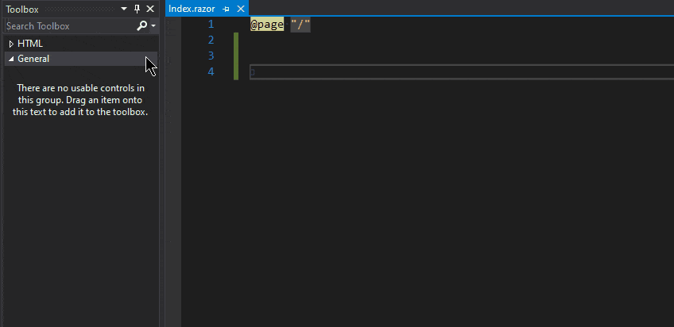

## Description
I'm trying to build Blazor Apps, both Server and Web Assembly using Visual Studio Professional 2019.  When I open a .razor component in design view, the Toolbox does not contain any (Telerik) tools.  This is true whether I use the generic Blazor App template or any of the Telerik Blazor templates.

How can add the Blazor tools I purchased from Telerik to the Toolbox?

I have created a new Telerik Blazor project in Visual Studio.  I can't see any of the components that I can add to a page in the VS Toolbox.  How do I add the Telerik tools?

## Cause\Possible Cause(s)
Generally speaking, ASP.NET MVC/Core doesn't have the same kind of toolbox & designer integration that you're used to with platforms like WPF and ASP.NET AJAX.

For the most part, use of razor syntax based environments (like Blazor, MVC, Razor Pages)  is explicitly not a drag/drop affair. This allows for great flexibility in the layouts and types of applications you create without hindering the IDE with additional tools that need maintenance. The razor syntax has moved away from the concept of a drag-and-drop IDE and the Rapid-Application-Design towards code-first application creation.

Especially in Blazor, nesting components is a very common practice and creating a design surface to allow drag-and-drop will require that the entire application layout is evaluated and rendered. This would be an expensive and difficult operations.

## Suggested Workarounds
While there isn't a toolbox available for Blazor in general, there are a few things you can do to speed up development:

* Bookmark our documentation, especially components/feature you use often and copy the code snippets from the documentation in your projects as starting points.

* Consider creating your own set of custom code snippets in Visual Studio - you have full control over what you add there, and you can add some generic/basic Telerik components there. Feel free to copy them off our documentation pages.

    * The easiest way to create some is to highlight code in the editor and drag it to the toolbox. You can read more on creating code snippets in <a href="https://docs.microsoft.com/en-us/previous-versions/visualstudio/visual-studio-2015/ide/walkthrough-creating-a-code-snippet?view=vs-2015&redirectedfrom=MSDN" target="_blank">Visual Studio</a> and <a href="https://code.visualstudio.com/docs/editor/userdefinedsnippets" target="_blank">Visual Studio Code</a>.
    
    
