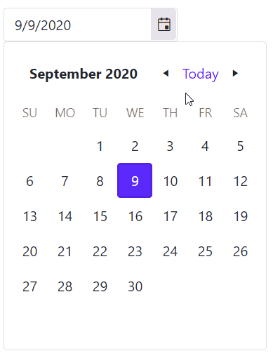
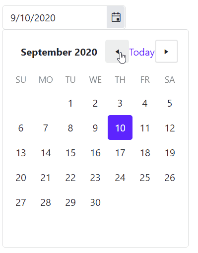
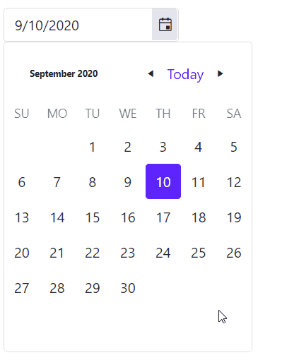

## Environment
<table>
	<tbody>
		<tr>
			<td>Product</td>
			<td>DatePicker for Blazor, Calendar for Blazor</td>
		</tr>
	</tbody>
</table>


## Description

I am using the Bootstrap theme and due to the larger font size the popup is being resized based on the length of the month's name. This cases the navigational arrows to be displaced.

>caption The popup of the DatePicker is resized based on month's name length




## Solutions

There are two possible solutions:

* [Using the PopupWidth parameter](#using-the-popupwidth-parameter)
* [Using CSS to reduce the font-size of the months name](#using-css-to-reduce-the-font--size-of-the-months-name)

### Using the PopupWidth parameter

You can control the popup width for the DatePicker by using the `PopupWidth` parameter that the components exposes. You can set it in `pixels` or any other valid CSS dimensions to fit the content of the dropdown.


````CSHTML
<TelerikDatePicker @bind-Value="datePickerValue" PopupWidth="300px"></TelerikDatePicker>

@code  {
    DateTime datePickerValue { get; set; } = DateTime.Now;
}
````

>caption The result from the code snippet above



### Using CSS to reduce the font-size of the months name

This example utilizes CSS to reduce the font-size of the month's name in the dropdown of the DatePicker. This solution might also be applied to the Telerik Calendar component for Blazor. 

>note If you are using it for the Calendar component you can pass a custom CSS class to the `Class` parameter of the Calendar and cascade the styles through that class.

````CSHTML
<style>
    .k-calendar .k-calendar-header .k-title.k-button {
        font-size: 10px;
    }
</style>

<TelerikDatePicker @bind-Value="datePickerValue" Class="myDatePicker"></TelerikDatePicker>

@code  {
    DateTime datePickerValue { get; set; } = DateTime.Now;
}
````

>caption The result from the code snippet above




