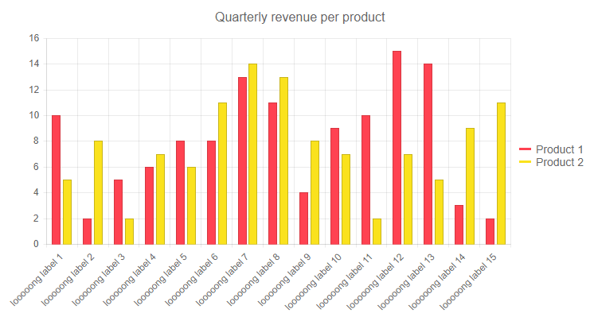

## Environment
<table>
	<tbody>
		<tr>
			<td>Product</td>
			<td>DatePicker for Blazor</td>
		</tr>
	</tbody>
</table>


## Description

I am using the Bootstrap theme and due to the larger font size the popup is being resized based on the length of the month's name. This cases the navigational arrows to be displaced.

>caption The popup of the DatePicker is resized based on month's name length


## Solution

You can control the popup width for the DatePicker by using the `PopupWidth` parameter that the components exposes. You can set it in `pixels` or any other valid CSS dimensions.


````CSHTML
<TelerikDatePicker @bind-Value="datePickerValue" PopupWidth="300px"></TelerikDatePicker>

@code  {
    DateTime datePickerValue { get; set; } = DateTime.Now;
}
````


>caption The result from the code snippet above




