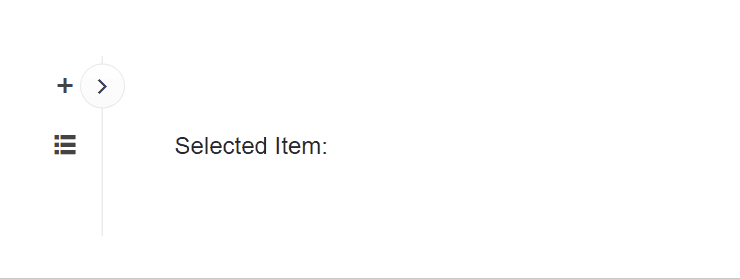

## Environment
<table>
	<tbody>
		<tr>
			<td>Product</td>
			<td>Drawer for Blazor</td>
		</tr>
	</tbody>
</table>


## Description

How to add a handle feature within the rendered Drawer component that would expand and collapse the component?

## Solution

To achieve the desired result you can try the following:

* Add a Telerik Button
* Toggle the Drawer on click of that button
* Use custom CSS to adjust the button's appearance, position, transition etc.

>caption Add Expand/Collapse Handle to Toggle the Drawer. The result from the snippet below.




````RAZOR
<TelerikButton Class="@($"toggle-button {(DrawerExpanded ? "expanded" : "collapsed")}")"
               Icon="@(DrawerExpanded ? "chevron-left" : "chevron-right")"
               OnClick="@(async () => await DrawerRef!.ToggleAsync())" />

<TelerikDrawer @ref="@DrawerRef"
               Data="@DrawerData"
               @bind-Expanded="@DrawerExpanded"
               MiniMode="true"
               Mode="DrawerMode.Push"
               @bind-SelectedItem="@SelectedItem"
               Width="@DrawerWidth">
    <DrawerContent>
        <div style="padding: var(--kendo-spacing-6);">
            Selected Item: @SelectedItem?.Text
        </div>
    </DrawerContent>
</TelerikDrawer>

<style>
    .toggle-button {
        transform: translateY(50%);
        z-index: 1;
        border: 1px solid rgba(0, 0, 0, 0.08);
        border-radius: 50%;
        background-color: #fff;
        transition: all 300ms ease-in-out; /* Match the Drawer animation. */
    }
    
    .toggle-button.collapsed {
            top: 20px;
            left: calc(var(--kendo-spacing-4) * 2); /* Match the Drawer width in Mini mode. */
    }
    
    .toggle-button.expanded {
            top: 20px;
            left: calc(@DrawerWidth - 15px); /* Match the Drawer Width. */
    }
</style>

@code {
    private TelerikDrawer<DrawerItem>? DrawerRef;

    private bool DrawerExpanded { get; set; }

    private DrawerItem? SelectedItem { get; set; }

    private string DrawerWidth { get; set; } = "240px";
    
    private IEnumerable<DrawerItem> DrawerData { get; set; } =
        new List<DrawerItem>()
        {
            new DrawerItem { Text = "Counter", Icon = SvgIcon.Plus },
            new DrawerItem { Text = "FetchData", Icon = SvgIcon.GridLayout }
        };

    public class DrawerItem
    {
        public ISvgIcon? Icon { get; set; }
        public string Text { get; set; } = string.Empty;
    }
}
````

## See Also

* [CSS Isolation does not work for Telerik components](slug:common-kb-css-isolation)
* [Override Theme Styles](slug:themes-override)
