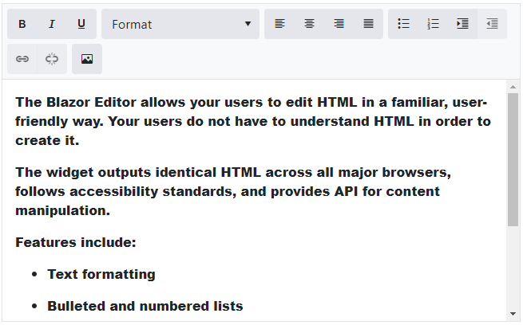
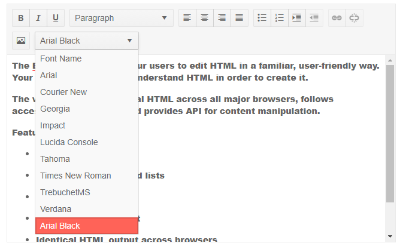

## Environment
<table>
	<tbody>
		<tr>
			<td>Product</td>
			<td>Editor for Blazor</td>
		</tr>
	</tbody>
</table>


## Description

I would like to set a default font typeface to the Editor.


## Solutions

The default font typeface of the content area of the Editor is based on the default font of the browser it is run under. When you are using the Editor in [Div]() edit mode you can use CSS rules to define the default font-family for the content area of the component. The control exposes a `Class` parameter that takes a custom CSS class which can be used to cascade the required styles. 

>caption Set a default font family for the content area of the Editor in Div edit mode

````CSHTML
@* The style rule is important, it matches the Class of the component *@

<style>
    .myTelerikEditor div.k-editor-content div.k-content {
        font-family: "Arial Black", Gadget, sans-serif;
    }
</style>

<TelerikEditor @bind-Value="@TheEditorValue"
               Width="650px"
               Height="400px"
               EditMode="@EditorEditMode.Div"
               Class="myTelerikEditor">
</TelerikEditor>

@code{
    string TheEditorValue { get; set; }

    protected override Task OnInitializedAsync()
    {
        TheEditorValue = @"
            <p>
                The Blazor Editor allows your users to edit HTML in a familiar, user-friendly way. Your users do not have to understand HTML in order to create it.
            </p>
            <p>
                The widget <strong>outputs identical HTML</strong> across all major browsers, follows
                accessibility standards, and provides API for content manipulation.
            </p>
            <p>Features include:</p>
            <ul>
                <li>Text formatting</li>
                <li>Bulleted and numbered lists</li>
                <li>Hyperlinks</li>
                <li>Cross-browser support</li>
                <li>Identical HTML output across browsers</li>
                <li>Ability to create custom tools, dropdowns, dialogs</li>
            </ul>
        ";
        return base.OnInitializedAsync();
    }
}
````

>caption The result from the code snippet above



## Additional Example

This example showcases how to set a default font for the content area of the Editor and add that font to the built-in FontFamily tool.

````CSHTML
@using Telerik.Blazor.Components.Editor

<style>
    .myTelerikEditor div.k-editor-content div.k-content {
        font-family: "Arial Black", Gadget, sans-serif;
    }
</style>

<TelerikEditor @bind-Value="@TheEditorValue"
               Width="650px" 
               Height="400px"
               EditMode="@EditorEditMode.Div"
               Tools="@MyTools"
               Class="myTelerikEditor">
</TelerikEditor>

@code{
    string TheEditorValue { get; set; }
    public List<IEditorTool> MyTools { get; set; }

    protected override Task OnInitializedAsync()
    {
        //initialize the toolbar collection with all built-in tools
        MyTools = new List<IEditorTool>(EditorToolSets.Default);

        //add the typeface to the default list of fonts
        List<EditorDropDownListItem> fontFamilyChoices = new List<EditorDropDownListItem>(EditorDropDownListToolItems.FontFamilyItems);
        fontFamilyChoices.Add(new EditorDropDownListItem()
        {
            Text = "Arial Black",
            Value = "Arial Black"
        });

        MyTools.Add(new FontFamily() { Data = fontFamilyChoices });

        TheEditorValue = @"
            <p>
                The Blazor Editor allows your users to edit HTML in a familiar, user-friendly way. Your users do not have to understand HTML in order to create it.
            </p>
            <p>
                The widget <strong>outputs identical HTML</strong> across all major browsers, follows
                accessibility standards, and provides API for content manipulation.
            </p>
            <p>Features include:</p>
            <ul>
                <li>Text formatting</li>
                <li>Bulleted and numbered lists</li>
                <li>Hyperlinks</li>
                <li>Cross-browser support</li>
                <li>Identical HTML output across browsers</li>
                <li>Ability to create custom tools, dropdowns, dialogs</li>
            </ul>
        ";
        return base.OnInitializedAsync();
    }
}
````

>caption The result from the code snippet above




