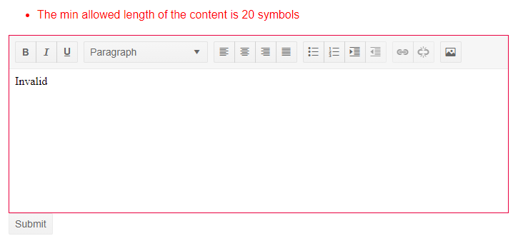

## Environment
<table>
	<tbody>
		<tr>
			<td>Product</td>
			<td>Editor for Blazor</td>
		</tr>
	</tbody>
</table>


## Description

I would like to set the Editor in invalid state when validation does not pass by adding a red border around the component. 


>caption The goal (result) from the solution below




## Solution

The Editor is a composite component and as such, currently, does not support the `k-state-invalid` class. In order to add a red border when the validation set for its value does not pass you can make a custom CSS class that mimics k-state-invalid and add it to the `Class` parameter based on a `bool` expression.

You can utilize the capabilities and information provided by the `EditContext` to determine if the validation did not pass for the exact field bound to the Editor and render anew the component to apply the custom CSS class. A step by step explanation and an example of those concepts can be found below.

#### Step by step explanation:

1. Create a custom CSS class that mimics the k-state-invalid.
1. Pass an `EditContext` to the `<EditForm>`.
1. Instantiate a `FieldIdentifier` and in its constructor pass the data model and the field bound to the Editor. 
1. Use a getter-only property to check if there are any validation messages for that `FieldIdentifier`.
1. In the handler for the `OnValidationStateChanged` event call a `StateHasChanged()` to render the component anew. 
1. Use the `Class` parameter to pass the custom CSS class.

>caption Set the Editor in invalid state when validation does not pass

````CSHTML
@*This is the custom class that mimics k-state-invalid*@
<style>
    .myCustomInvalidState {
        border-color: #dc3545;
    }
</style>

@using System.ComponentModel.DataAnnotations

<EditForm EditContext="@MyEditContext" OnValidSubmit="@HandleValidSubmit">
    <DataAnnotationsValidator />
    <ValidationSummary />

    <TelerikEditor @bind-Value="@theProduct.Description" Class="@(IsEditorInvalidSubmit ? "myCustomInvalidState" : "")">
    </TelerikEditor>

    <TelerikButton ButtonType="@ButtonType.Submit">Submit</TelerikButton>
</EditForm>

@code {
    protected EditContext MyEditContext { get; set; }

    public FieldIdentifier EditorFieldIdentifier { get; set; } // instantiating a FieldIdentifier for the Editor,
                                                               // see the OnInitialize on how to pass the model and the field

    //checking for validation messages for the editor
    public bool IsEditorInvalidSubmit => MyEditContext.GetValidationMessages(EditorFieldIdentifier).Any();

    //calling StateHasChanged to render the component again
    private void HandleValidationStateChanged(object o, ValidationStateChangedEventArgs args) => StateHasChanged();

    protected override void OnInitialized()
    {
        MyEditContext = new EditContext(theProduct);
        EditorFieldIdentifier = new FieldIdentifier(theProduct, nameof(theProduct.Description));
        MyEditContext.OnValidationStateChanged += HandleValidationStateChanged;
    }

    public class Product
    {
        [Required(ErrorMessage = "Description is required")]
        [MaxLength(100, ErrorMessage = "The max allowed length of the content is 100 symbols")]
        [MinLength(20, ErrorMessage = "The min allowed length of the content is 20 symbols")]
        public string Description { get; set; }
    }

    Product theProduct = new Product();

    void HandleValidSubmit()
    {
        Console.WriteLine("SUCCESS");
    }
}
````


