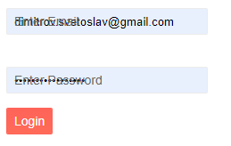

## Environment
<table>
	<tbody>
		<tr>
			<td>Product</td>
			<td>Form for Blazor, all inputs (textboxes)</td>
		</tr>
	</tbody>
</table>

## Description

I am using the Telerik Form for Blazor. When the application is rendered in Chrome, the browser automatically completes the fields of the Form. The floating labels are not moved and the autofilled values are overlapped by the text from the label.

#### Problematic display



## Cause of the Problem

When Chrome autofills the values in the fields in the form the `oninput` and `onfocus` events are not fired. This means that the browser does not notify the fields that their values have changed and thus the floating label remains inside the TelerikTextbox. 

The application is not given the chance to respond to the autofill action of the browser because no events are fired.

## To Reproduce

1. Run this snippet in the browser
2. Fill in the form and click Submit
3. In the browser popup asking you to save the data for the future, confirm and let Chrome save it
4. Reload the page - the browser will autofill the saved data

````CSHTML
@* This example showcases the problematic configuration *@ 

<TelerikForm Model="@person" OnValidSubmit="@HandleValidSubmit" Width="50%">
    <FormValidation>
        <DataAnnotationsValidator></DataAnnotationsValidator>
    </FormValidation>
    <FormItems>
        <FormItem>
            <Template>
                <TelerikTextBox PlaceHolder="john@smith.com" Title="Email" @bind-Value="@person.LoginId"
                                Label="Enter Email" InputMode="email" Id="email" AutoComplete="email" Name="email">
                </TelerikTextBox>
            </Template>
        </FormItem>
        <FormItem>
            <Template>
                <TelerikTextBox Password="true"
                                Label="Enter Password"
                                @bind-Value="@person.Password"
                                AutoComplete="new-password" Name="password" Id="password">
                </TelerikTextBox>
            </Template>
        </FormItem>
    </FormItems>
    <FormButtons>
        <TelerikButton ButtonType="ButtonType.Submit" Primary="true">Login</TelerikButton>
    </FormButtons>
</TelerikForm>


@code {
    public Person person = new Person();

    public class Person
    {
        public string LoginId { get; set; }
        public string Password { get; set; }
    }
    private async Task HandleValidSubmit()
    {
        // On valid submit
    }
}
````

## Solution


To solve this appearance glitch, disable the floating label of the Telerik Textbox by removing its `Label` parameter.

You can also add a standard HTML `<label>` element to have a label for your input.

````CSHTML
@* Provide labels for the Textboxes *@

<TelerikForm Model="@person" OnValidSubmit="@HandleValidSubmit" Width="50%">
    <FormValidation>
        <DataAnnotationsValidator></DataAnnotationsValidator>
    </FormValidation>
    <FormItems>
        <FormItem>
            <Template>
                <label for="email">Enter your email</label>
                <TelerikTextBox PlaceHolder="john@smith.com" Title="Email" @bind-Value="@person.LoginId"
                                InputMode="email" Id="email" AutoComplete="email" Name="email">
                </TelerikTextBox>
            </Template>
        </FormItem>
        <FormItem>
            <Template>
                <label for="password">Enter your password</label>
                <TelerikTextBox Password="true"
                                @bind-Value="@person.Password"
                                AutoComplete="password" 
                                Name="password" 
                                Id="password">
                </TelerikTextBox>
            </Template>
        </FormItem>
    </FormItems>
    <FormButtons>
        <TelerikButton ButtonType="ButtonType.Submit" Primary="true">Login</TelerikButton>
    </FormButtons>
</TelerikForm>


@code {
    public Person person = new Person();

    public class Person
    {
        public string LoginId { get; set; }
        public string Password { get; set; }
    }
    private async Task HandleValidSubmit()
    {
        // On valid submit
    }
}
````

## See Also

* [Label not moved from input on browser autofill in Chrome]()

* [Empty TextBox value on Chrome autofill]()