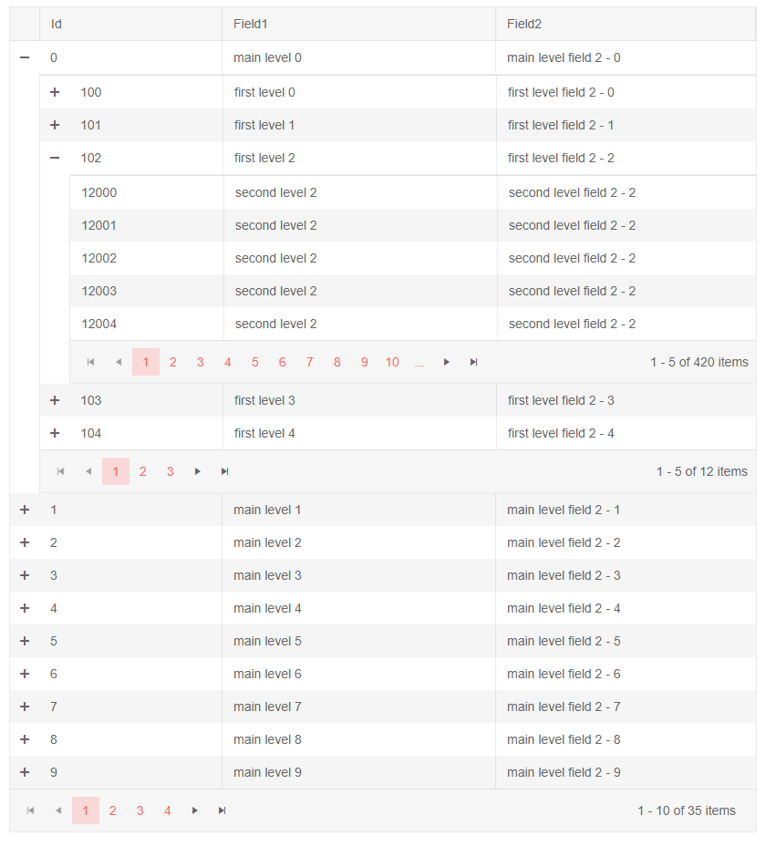

## Environment
<table>
	<tbody>
		<tr>
			<td>Product</td>
			<td>Grid for Blazor</td>
		</tr>
	</tbody>
</table>


## Description
I want to showcase hierarchical data in the grid and to make the DetailTemplate columns match the main column headers.

## Solution
While generally a task for a treelist type of component, you can show self-referencing data in a grid through its detail templates and if the field names match, you can even use the only the headers from the main grid.

To align the columns of nested grid detail templates, you need to:

* set a width to the grid that matches the width of its columns
* set width to the columns of the nested grids that match the column widths of the main grid
    * the first column of each child grid must have width smaller than the first column of the main grid with the size of the hierarchy expand column times the levels of hierarchy that you have
* add styles that remove the scrollbars from the grid to clean out the UI and reduce distortions that they can cause
* optionally, hide the headers of the nested grids

>caption The result from the code snippet below




>caption Align the columns in hierarchical grids

````CSHTML
@* Three levels of grids - note how the first columns of the nested grids have the width of the detail expand cell subtracted twice
    for the Default Theme, it is 2*32px but that can vary between themes and based on the font-size of the page.
    Also, the main grid has a width that matches closely the sum of the column widths and the horizontal scrollbars
    are hidden in order to produce cleaner UX *@

<style>
    /* remove the default padding from the detail template cell to facilitate column alignment */
    .no-detail-padding.k-grid .k-detail-cell {
        padding: 0;
    }

        /*  */
        .no-detail-padding.k-grid .k-detail-cell .k-header {
            display: none;
        }

    /* hide horizontal scrollbars on the grids to produce cleaner UI for the user */
    .no-detail-padding.k-grid .k-grid-content {
        overflow-x: hidden;
    }

    /* hide vertical scrollbars to simplify UI, also reduces the chance of mismatch between column headers */
    .no-detail-padding.k-grid > .k-grid-header {
        padding-right: 0 !important;
    }

    .no-detail-padding.k-grid .k-grid-content {
        overflow-y: hidden;
    }
</style>

<TelerikGrid Data="@MainLevelsData" Class="no-detail-padding" Width="820px" Pageable="true">
    <GridColumns>
        <GridColumn Field="Id" Width="200px"></GridColumn>
        <GridColumn Field="Field1" Width="300px"></GridColumn>
        <GridColumn Field="Field2" Width="300px"></GridColumn>
    </GridColumns>
    <DetailTemplate Context="firstLevelItem">
        @{
            var currGridData = GetLevelData(firstLevelItem.Id);
            <TelerikGrid Data="@currGridData" Pageable="true" PageSize="5">
                <GridColumns>
                    <GridColumn Field="Id" Width="168px"></GridColumn>
                    <GridColumn Field="Field1" Width="300px"></GridColumn>
                    <GridColumn Field="Field2" Width="300px"></GridColumn>
                </GridColumns>
                <DetailTemplate Context="secondLevelItem">
                    @{
                        var currGridData = GetLevelData(secondLevelItem.Id);
                        <TelerikGrid Data="@currGridData" Pageable="true" PageSize="5">
                            <GridColumns>
                                <GridColumn Field="Id" Width="168px"></GridColumn>
                                <GridColumn Field="Field1" Width="300px"></GridColumn>
                                <GridColumn Field="Field2" Width="300px"></GridColumn>
                            </GridColumns>
                        </TelerikGrid>
                    }
                </DetailTemplate>
            </TelerikGrid>
        }
    </DetailTemplate>
</TelerikGrid>


@code {
    List<SelfReferencingHierarchyModel> MainLevelsData { get; set; }
    List<SelfReferencingHierarchyModel> AllData { get; set; }

    public class SelfReferencingHierarchyModel
    {
        public int Id { get; set; }
        public int? ParentId { get; set; }
        public string Field1 { get; set; }
        public string Field2 { get; set; }
    }

    protected override void OnInitialized()
    {
        AllData = new List<SelfReferencingHierarchyModel>();

        //generate top level items
        for (int i = 0; i < 35; i++)
        {
            AllData.Add(new SelfReferencingHierarchyModel
            {
                Id = i,
                Field1 = $"main level {i}",
                Field2 = $"main level field 2 - {i}"
            });

            for (int j = 0; j < 12; j++)
            {
                //generate first level items - note the Id and ParentId logic
                AllData.Add(new SelfReferencingHierarchyModel
                {
                    Id = 100 + j,
                    ParentId = i,
                    Field1 = $"first level {j}",
                    Field2 = $"first level field 2 - {j}"
                });

                for (int k = 0; k < 12; k++)
                {
                    //generate second level items - note the Id and ParentId logic
                    AllData.Add(new SelfReferencingHierarchyModel
                    {
                        Id = 6000 * j + k, // does not really produce unique IDs here, but for this sample it does not matter
                        ParentId = 100 + j,
                        Field1 = $"second level {j}",
                        Field2 = $"second level field 2 - {j}"
                    });
                }
            }
        }

        MainLevelsData = AllData.Where(itm => itm.ParentId == null).ToList();
    }

    List<SelfReferencingHierarchyModel> GetLevelData(int parentId)
    {
        return AllData.Where(itm => itm.ParentId == parentId).ToList();
    }
}
````


