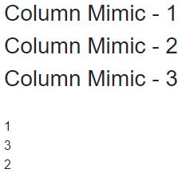

## Environment
<table>
	<tbody>
		<tr>
			<td>Product</td>
			<td>Grid for Blazor</td>
		</tr>
	</tbody>
</table>


## Description
I have noticed that if I specify a GridColumn in a razor component and then try to use it in a Telerik Grid elsewhere, this column gets set as the last one on the right, regardless of where I place it in my code (the "html" order). Is there any way to either make the "html" order matter or to specify the position of the column in a grid?

When you use `GridColumn` tags directly in the grid markup, they are rendered in the order they are set in the markup.

When you put a `GridColumn` in a custom component in the app and put that component in the grid columns declaration, the column is not rendered in the place of declaration but at the end.


## Cause\Possible Cause(s)

This behavior stems from the order in which the framework initializes components.

All parent components are initialized before their child components.

On initialization, child components can't be rendered before the parent components. This is why the order in the actual code can't affect the order on initialization - the grid receives the `GridColumn` instances in the order in which their components are initialized. The columns that are added later in the component lifecycle will also be last.

You can observe and reproduce the same behavior with the example below.

>caption Components rendering. The result from the code snippet below.



````GridColumnMimic.razor
@* This mimics the <GridColumn> tag *@

<h3>Column Mimic - @Id</h3>

@code {
    [Parameter]
    public int Id { get; set; }

    [CascadingParameter]
    public Index ParentComponent {get;set;}

    protected override void OnInitialized()
    {
        ParentComponent.AddChildToParent(Id);
        Console.WriteLine(Id);
        base.OnInitialized();
    }
}
````

````NestedComponent.razor
@* This is the custom component that adds grid columns *@

<GridColumnMimic Id="@Id"></GridColumnMimic>

@code {
    [Parameter]
    public int Id { get; set; }
}
````

````Index.razor
@page "/"

<CascadingValue Value="this">
    <GridColumnMimic Id="1"></GridColumnMimic>
    <NestedComponent Id="2"></NestedComponent>
    <GridColumnMimic Id="3"></GridColumnMimic>
</CascadingValue>

@( new MarkupString(result) )

@*Will output:
         1
         3
         2

   Instead of:
         1
         2
         3
*@

@code {
    string result { get; set; }

    public void AddChildToParent(int index)
    {
        result += $"<br />{index}";
        StateHasChanged();
    }
}
````

>tip If you want to have conditional columns, you can use the [`Visible`]() parameter. The condition can be a ternary operator or a method that returns a bool.

## Solution

There are two ways for specifying the position of the columns in the grid:

* Avoid nesting components and put the grid columns directly under the grid tag.

* Use the [Grid State](), its methods (`GetState`, `SetState`) and events (`OnStateInit`, `OnStateChanged`) to get the collection of column states and change the `Order` of the instances you want to rearrange.
