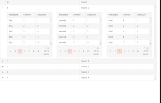

## Environment
<table>
	<tbody>
		<tr>
			<td>Product</td>
			<td>Grid for Blazor</td>
		</tr>
	</tbody>
</table>


## Description
I want to have the detail pushed to the side when there is enough room, and I want to push the detail down below the grid when there isn't.

I want to have a few grids or tables in a row in the grid hierarchy detail template side by side, but on small screens I want them to stack on top of each other.

## Solution
You can array the child grids or other elements/components in any responsive layout you would normally use for your app - the DetailTemplate gives you full control over the rendering.

For example, you can use tools like Bootstrap to put columns with grids next to, or above each other in the detail template, depending on the available size.

Here is an example with bootstrap row holding columns to make responsive layout with three child grids in the detail template



````CSHTML
<TelerikGrid Data="salesTeamMembers">
    <DetailTemplate>
        @{
            var employee = context as MainModel;
            
            @* here follows a sample responsive Bootstrap layout with three grids in its columns *@

            <div class="row">
                <div class="col-sm">
                    <TelerikGrid Data="employee.Orders" Pageable="true" PageSize="5" AutoGenerateColumns="true">
                    </TelerikGrid>
                </div>
                <div class="col-sm">
                    <TelerikGrid Data="employee.Orders2" Pageable="true" PageSize="5" AutoGenerateColumns="true">
                    </TelerikGrid>
                </div>
                <div class="col-sm">
                    <TelerikGrid Data="employee.Orders3" Pageable="true" PageSize="5" AutoGenerateColumns="true">
                    </TelerikGrid>
                </div>
            </div>

        }
    </DetailTemplate>
    <GridColumns>
        <GridColumn Field="Id"></GridColumn>
        <GridColumn Field="Name"></GridColumn>
    </GridColumns>
</TelerikGrid>

@code {
    List<MainModel> salesTeamMembers { get; set; }

    protected override void OnInitialized()
    {
        salesTeamMembers = GenerateData();
    }

    private List<MainModel> GenerateData()
    {
        List<MainModel> data = new List<MainModel>();
        for (int i = 0; i < 5; i++)
        {
            MainModel mdl = new MainModel { Id = i, Name = $"Name {i}" };
            mdl.Orders = Enumerable.Range(1, 15).Select(x => new DetailsModel { metadata = "first", OrderId = x, DealSize = x ^ i }).ToList();
            mdl.Orders2 = Enumerable.Range(1, 15).Select(x => new DetailsModel { metadata = "second", OrderId = x, DealSize = x ^ i }).ToList();
            mdl.Orders3 = Enumerable.Range(1, 15).Select(x => new DetailsModel { metadata = "third", OrderId = x, DealSize = x ^ i }).ToList();
            data.Add(mdl);
        }
        return data;
    }

    public class MainModel
    {
        public int Id { get; set; }
        public string Name { get; set; }
        public List<DetailsModel> Orders { get; set; }
        public List<DetailsModel> Orders2 { get; set; }
        public List<DetailsModel> Orders3 { get; set; }
    }

    public class DetailsModel
    {
        public string metadata { get; set; }
        public int OrderId { get; set; }
        public double DealSize { get; set; }
    }
}
````
