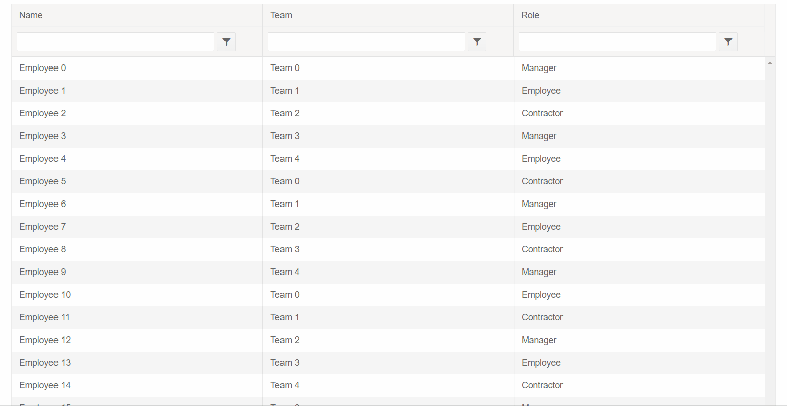
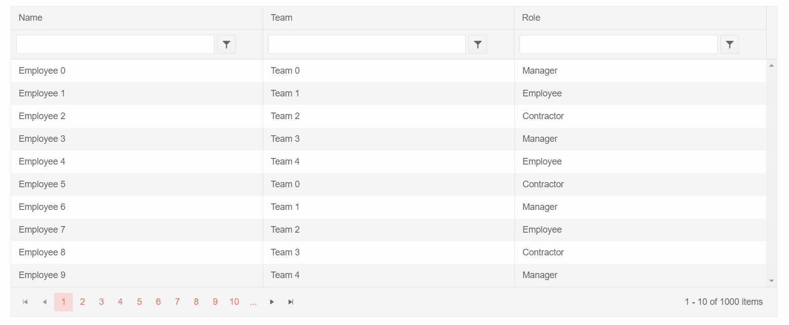

## Environment
<table>
	<tbody>
		<tr>
			<td>Product</td>
			<td>Grid for Blazor</td>
		</tr>
	</tbody>
</table>


## Description
I have a Grid with Incell editing mode, and one of its columns uses EditorTemplate with TelerikDropDownList.

When I quickly click on the dropdown twice, it doesn't open, or opens as blank, and clicking on it more times does not help. It does not reproduce when double-clicking slowly.

## Steps to Reproduce

You can try running the snippet below to reproduce the described behavior. It showcases a Grid with large portion of records to demonstrate how slow rendering performance can affect the behavior of a DropDownList in InCell edit mode.

To reproduce, double click quickly a row in the `Role` column.


 
````CSHTML
@* Grid with slow rendering performance causing issue with the DropDownList opening *@

<TelerikGrid Data=@GridData
             Sortable="true"
             FilterMode="@GridFilterMode.FilterRow"
             OnUpdate="@UpdateHandler" EditMode="GridEditMode.Incell">

    <GridColumns>
        <GridColumn Field="@nameof(Employee.Name)" />
        <GridColumn Field="@nameof(Employee.Team)" Title="Team" />
        <GridColumn Field="@nameof(Employee.Role)">           
            <EditorTemplate>
                @{
                    CurrentlyEditedEmployee = context as Employee;
                    <TelerikDropDownList Data="@Roles" Width="100%" @bind-Value="@CurrentlyEditedEmployee.Role" />
                }
            </EditorTemplate>
        </GridColumn>
    </GridColumns>
</TelerikGrid>

@code {
    public List<Employee> GridData { get; set; }

    Employee CurrentlyEditedEmployee { get; set; }

    private static List<string> Roles = new List<string> { "Manager", "Employee", "Contractor" };

    public void UpdateHandler(GridCommandEventArgs args)
    {
        var argsItem = args.Item as Employee;
        var index = GridData.FindIndex(i => i.EmployeeId == argsItem.EmployeeId);
        if (index != -1)
        {
            GridData[index] = argsItem;
        }
    }

    protected override void OnInitialized()
    {
        GridData = new List<Employee>();
        var rand = new Random();
        for (int i = 0; i < 1000; i++)
        {
            GridData.Add(new Employee()
            {
                EmployeeId = i,
                Name = "Employee " + i.ToString(),
                Team = "Team " + i % 5,
                Role = Roles[i % Roles.Count]
            });
        }
    }

    public class Employee
    {
        public int EmployeeId { get; set; }
        public string Name { get; set; }
        public string Team { get; set; }
        public string Role { get; set; }
    }
}
````

>caption DropDownList in Grid InCell edit mode does not open on double click. The result from the above snippet.




## Cause\Possible Cause(s)

Such behavior stems from the lifecycle of the Blazor framework and the time it takes for the Grid to be re-rendered. The double click causes a race condition between the rendering of the Grid and initialization of the DropDownList in its Editor template.

If you quickly click (double click) on the cell containing a DropDownList, the flow of the processes is as follows:

1. First click - as per the setup of the Grid InCell Edit mode, when you first click on a cell it is opened for edit - OnEdit fires.

1. When OnEdit fires the Grid is re-rendered - the time needed for re-rendering may vary due to the Grid data size and possible network latency ( for example, if you are dealing with large portion of data in the Grid, that slows down its rendering process as observed in the reproduction above).

1. Second click is performed quickly after the first one - Grid re-rendering might not still be completed and the DropDownList in the Editor Template is not initialized fully, its content is not loaded.

1. Grid re-rendering is completed, the DropDownList in the Editor Template is initialized, however the second click that should be responsible for opening its popup has already passed (a third click at this stage could open the popup as seen in the reproduction, however this is not the behavior we are seeking for).


## Solution

The described behavior can be resolved if you optimize the rendering performance of the Grid. There are a couple of ways you can try in order to achieve that:

* [Paging]() - you can enable the `Pageable` property of the Grid and control the number of records that will be displayed per page, so you don't display all records per once and deal with slow performance due to the large data portion that the Grid has to render. Using the pager, you will reduce the time needed for the Grid to re-render.

* [Virtual Scrolling]() - it is an alternative to paging. Instead of using a pager, the user scrolls vertically through all records in the data source. The same set of elements is reused to improve the rendering performance.

* [Column virtualization]() - Virtual Scrolling for the columns of the Grid allows the columns and the corresponding data to be rendered only for the currently visible viewport and thus improving the component's performance. The targeted scenario for this feature is for a Grid with big number of columns.

The sample below demonstrates how to achieve the desired behavior by using the `Pageable` property of the Grid to display less records at a time and thus to reduce the time needed for re-rendering the Grid.

````CSHTML
@* Grid with improved rendering performance - DropDownList opening correctly *@

<TelerikGrid Data=@GridData
             Pageable="true"
             Sortable="true"
             FilterMode="@GridFilterMode.FilterRow"
             OnUpdate="@UpdateHandler" EditMode="GridEditMode.Incell">

    <GridColumns>
        <GridColumn Field="@nameof(Employee.Name)" />
        <GridColumn Field="@nameof(Employee.Team)" Title="Team" />
        <GridColumn Field="@nameof(Employee.Role)">           
            <EditorTemplate>
                @{
                    CurrentlyEditedEmployee = context as Employee;
                    <TelerikDropDownList Data="@Roles" Width="100%" @bind-Value="@CurrentlyEditedEmployee.Role" />
                }
            </EditorTemplate>
        </GridColumn>
    </GridColumns>
</TelerikGrid>

@code {
    public List<Employee> GridData { get; set; }

    Employee CurrentlyEditedEmployee { get; set; }

    private static List<string> Roles = new List<string> { "Manager", "Employee", "Contractor" };

    public void UpdateHandler(GridCommandEventArgs args)
    {
        var argsItem = args.Item as Employee;
        var index = GridData.FindIndex(i => i.EmployeeId == argsItem.EmployeeId);
        if (index != -1)
        {
            GridData[index] = argsItem;
        }
    }

    protected override void OnInitialized()
    {
        GridData = new List<Employee>();
        var rand = new Random();
        for (int i = 0; i < 1000; i++)
        {
            GridData.Add(new Employee()
            {
                EmployeeId = i,
                Name = "Employee " + i.ToString(),
                Team = "Team " + i % 5,
                Role = Roles[i % Roles.Count]
            });
        }
    }

    public class Employee
    {
        public int EmployeeId { get; set; }
        public string Name { get; set; }
        public string Team { get; set; }
        public string Role { get; set; }
    }
}
````

>caption Improve the performance of the Grid to achieve the desired behavior. The result from the above snippet.



## Notes

The InCell edit mode requires a single click to put the cell in edit mode, a double click is unnecessary. You can also use the keyboard alone to enter edit mode (through the Enter key).

Ultimately, a race condition with a double click can still occur and the steps above can only mitigate the chances for that to an extent.

