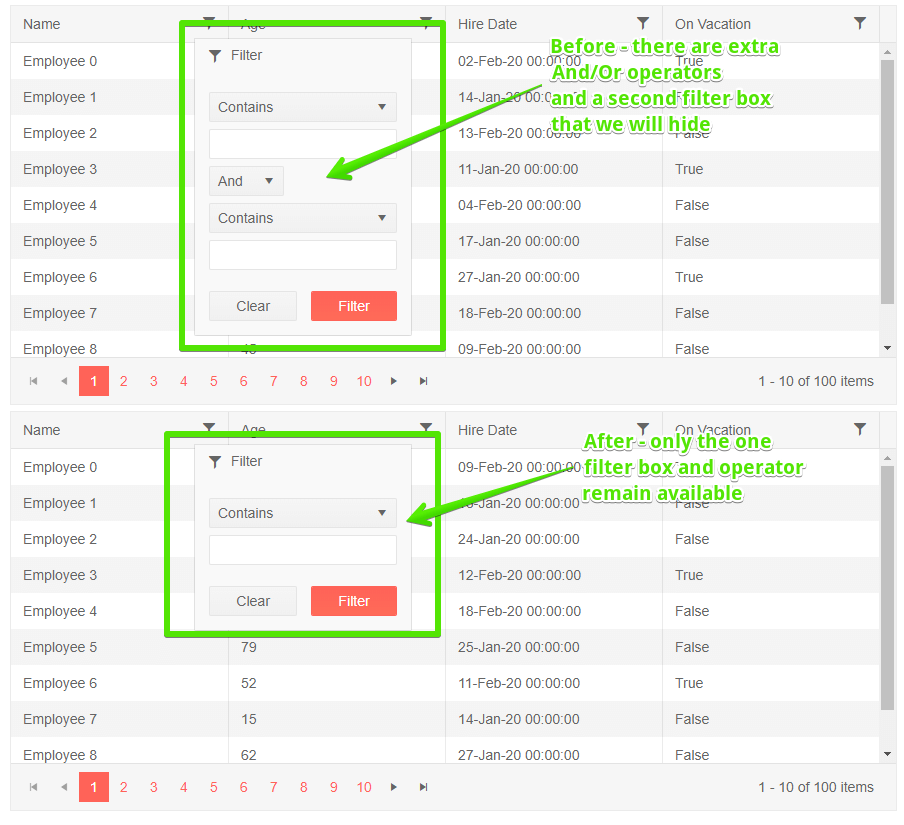

## Environment
<table>
	<tbody>
		<tr>
			<td>Product</td>
			<td>Grid for Blazor</td>
		</tr>
	</tbody>
</table>


## Description
I want simple filtering options in the filter menu - both for my uses and my backend. How do I remove the extra conditions so it behaves like the filter row and does not have extra and/or operators

>caption Before and after results



## Solution

There are two options:

* A [custom filter template]() provides full flexibility, including on building the filter descriptor. This is the approach we recommend for such a scenario.

* You can use CSS to hide the elements that provide the and/or secondary conditions. An example of this is provided below. Note that the CSS rules used by the grid rendering may change and that these rules will also target all the grids on the page.

>caption Hide And/Or filter options in FilterMenu with CSS

````CSHTML
@* These CSS rules hide the second component wrappers *@

<style>
    .k-filter-menu-container .k-widget.k-dropdown,
    .k-filter-menu-container .k-state-empty:nth-of-type(2n),
    .k-filter-menu-container .k-textbox:nth-of-type(2n),
    .k-filter-menu-container .k-datepicker:nth-of-type(2n+1),
    .k-filter-menu-container .k-numerictextbox:nth-of-type(2n) {
        display: none;
    }

        .k-filter-menu-container .k-widget.k-dropdown:first-of-type {
            display: block;
        }
</style>

<TelerikGrid Data=@GridData FilterMode="Telerik.Blazor.GridFilterMode.FilterMenu"
             Pageable="true" Height="400px">
    <GridColumns>
        <GridColumn Field=@nameof(Employee.Name) />
        <GridColumn Field=@nameof(Employee.AgeInYears) Title="Age" />
        <GridColumn Field=@nameof(Employee.HireDate) Title="Hire Date" />
        <GridColumn Field=@nameof(Employee.IsOnLeave) Title="On Vacation" />
    </GridColumns>
</TelerikGrid>

@code {
    public List<Employee> GridData { get; set; }

    protected override void OnInitialized()
    {
        GridData = new List<Employee>();
        var rand = new Random();
        for (int i = 0; i < 100; i++)
        {
            GridData.Add(new Employee()
            {
                EmployeeId = i,
                Name = "Employee " + i.ToString(),
                AgeInYears = rand.Next(10, 80),
                HireDate = DateTime.Now.Date.AddDays(rand.Next(-20, 20)),
                IsOnLeave = i % 3 == 0
            });
        }
    }

    public class Employee
    {
        public int? EmployeeId { get; set; }
        public string Name { get; set; }
        public int? AgeInYears { get; set; }
        public DateTime HireDate { get; set; }
        public bool IsOnLeave { get; set; }
    }
}
````
