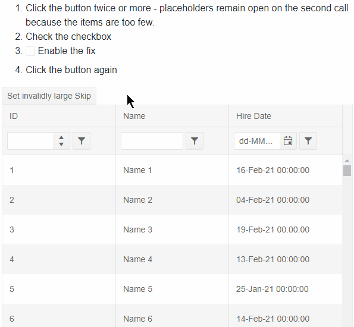

## Environment
<table>
	<tbody>
		<tr>
			<td>Product</td>
			<td>Grid for Blazor</td>
		</tr>
	</tbody>
</table>


## Description
We use [virtualization]() and set the `Skip` of the grid through its [state]()  (for example, to restore state from the user or to scroll the grid programmatically).

When the sum of the skip and the page size is bigger then the total count of the items and we try to set the Skip property for the second time, some of the top items are not shown.

>caption Recording of the problem and the solution (see the code below)



## Cause\Possible Cause(s)
The origin of the problem is that when the Skip value is too large, there may not be enough items to fill the grid viewport with data. 

For example, if the grid viewport could fit 15 items, but according to the `Skip` setting that you set there are only 8 items in the `Data`, those items cannot push the placeholder rows out of view, and you will still see them at the top of the grid.

## Solution
Ensure that you set such a `Skip` to the grid so that you don't show placeholders to your user. For example, when the data arrives, check if there are too few items and update the Skip value.

>caption Reproducible and a solution for setting an invalid (too large) Skip

````CSHTML
@using Telerik.DataSource.Extensions

<ol>
    <li>Click the button twice or more - placeholders remain open on the second call because the items are too few.</li>
    <li>Check the checkbox</li>
    <li>
        <label>
            <TelerikCheckBox @bind-Value="@shouldFixInvalidSkip"></TelerikCheckBox> Enable the fix
        </label>
    </li>
    <li>Click the button again</li>
</ol>

<TelerikButton OnClick="@( async () => await SetSkip(96) )">Set invalidly large Skip</TelerikButton>

<TelerikGrid Data=@GridData TotalCount=@Total OnRead=@ReadItems @ref="GridRef" PageSize="@PageSize"
             ScrollMode="@GridScrollMode.Virtual" RowHeight="50" Height="400px"
             FilterMode=@GridFilterMode.FilterRow Sortable=true>
    <GridColumns>
        <GridColumn Field=@nameof(Employee.ID) />
        <GridColumn Field=@nameof(Employee.Name) Title="Name" />
        <GridColumn Field=@nameof(Employee.HireDate) Title="Hire Date" />
    </GridColumns>
</TelerikGrid>

@code {
    //this part describes the problem and the solution (behind a flag so you can clearly see it)
    bool shouldFixInvalidSkip { get; set; }
    int PageSize = 20;
    TelerikGrid<Employee> GridRef { get; set; }
    async Task SetSkip(int skip)
    {
        if (GridRef != null)
        {
            var state = GridRef.GetState();
            state.Skip = skip;
            await GridRef.SetState(state);
        }
    }

    protected async Task ReadItems(GridReadEventArgs args)
    {
        //this should actually be happening on the server, but for brevity we do it here
        //see more at https://github.com/telerik/blazor-ui/tree/master/grid/datasourcerequest-on-server
        var datasourceResult = SourceData.ToDataSourceResult(args.Request);

        GridData = (datasourceResult.Data as IEnumerable<Employee>).ToList();
        Total = datasourceResult.Total;

        if (shouldFixInvalidSkip)
        {
            // when you set large Skip values manually you can check whether they will
            // cause an issue and correct that issue by setting a valid Skip value

            // with the current grid settings there can be 6 items in the viewport, calculate this as needed in your app
            // for example, based on the row size and grid height, or even use JS Interop if needed to get actual DOM elements' sizes
            int itemsThatFitPerPage = 6;
            bool isInvalidSkip = GridData.Count < itemsThatFitPerPage;
            //a general rule that could cause this is something like this issue is the following
            //but using that can prevent the user from scrolling all the way down to the last items
            //Total < (args.Request.Skip + PageSize);

            if (isInvalidSkip)
            {
                int matchingSkip = Total - itemsThatFitPerPage;
                await SetSkip(matchingSkip);
            }
        }

        await InvokeAsync(StateHasChanged);
    }

    // only basic data binding follows

    public List<Employee> SourceData { get; set; }
    public List<Employee> GridData { get; set; }
    public int Total { get; set; } = 0;

    protected override void OnInitialized()
    {
        SourceData = GenerateData();
    }

    private List<Employee> GenerateData()
    {
        var result = new List<Employee>();
        var rand = new Random();
        for (int i = 1; i < 101; i++)
        {
            result.Add(new Employee()
            {
                ID = i,
                Name = "Name " + i,
                HireDate = DateTime.Now.Date.AddDays(rand.Next(-20, 20))
            });
        }

        return result;
    }

    public class Employee
    {
        public int ID { get; set; }
        public string Name { get; set; }
        public DateTime HireDate { get; set; }
    }
}
````


## Notes

The grid cannot make this change for you because that would mean altering the state you provide, which would be invalid and unexpected behavior. Moreover, it could result in infinite loops or errors, and is a heuristic (undetermined) task.


