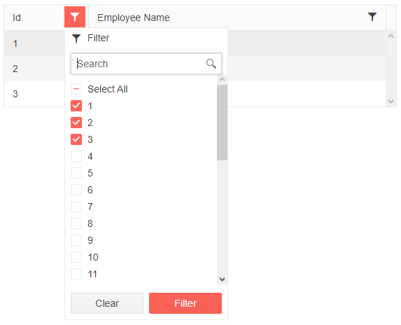

## Environment
<table>
	<tbody>
		<tr>
			<td>Product</td>
			<td>Grid for Blazor</td>
		</tr>
	</tbody>
</table>


## Description
How can I pre-set a checkbox filter using a filter descriptor? How to set checkbox filter on Grid first load? How can I statically specify the checkbox list content? How to set checkbox filter on the first initialization of the Grid?

## Solution
To pre-select checkbox filter in Grid using filter descriptor:

1. Use the [OnStateInit](https://docs.telerik.com/blazor-ui/components/grid/state#events) event of the Grid.
2. Implement **CompositeFilterDescriptor** inside the OnStateInit handler.

>caption The result from the code snippet below.



````Razor
@*Grid with pre-set checkbox filter on initial load.*@

<TelerikGrid Data="@MyData" FilterMode="@GridFilterMode.FilterMenu" FilterMenuType="@FilterMenuType.CheckBoxList"
             OnStateInit="@((GridStateEventArgs<SampleData> args) => OnStateInitHandler(args))">
    <GridColumns>
        <GridColumn Field="@(nameof(SampleData.Id))" Width="120px" />
        <GridColumn Field="@(nameof(SampleData.Name))" Title="Employee Name" />
    </GridColumns>
</TelerikGrid>

@code {
    async Task OnStateInitHandler(GridStateEventArgs<SampleData> args)
    {
        var state = new GridState<SampleData>
        {
            FilterDescriptors = new List<Telerik.DataSource.FilterDescriptorBase>()
            {
                new Telerik.DataSource.CompositeFilterDescriptor()
                {
                    FilterDescriptors = new Telerik.DataSource.FilterDescriptorCollection()
                    {
                        new Telerik.DataSource.FilterDescriptor() { Member = "Id", Value = 1, MemberType = typeof(int) },
                        new Telerik.DataSource.FilterDescriptor() { Member = "Id", Value = 2, MemberType = typeof(int) },
                        new Telerik.DataSource.FilterDescriptor() { Member = "Id", Value = 3, MemberType = typeof(int) },
                    },
                    LogicalOperator = Telerik.DataSource.FilterCompositionLogicalOperator.Or
                }
            },
        };

        args.GridState = state;
    }

    public IEnumerable<SampleData> MyData = Enumerable.Range(1, 30).Select(x => new SampleData
    {
        Id = x,
        Name = "name " + x,
    });

    public class SampleData
    {
        public int Id { get; set; }
        public string Name { get; set; }
    }
}
````
