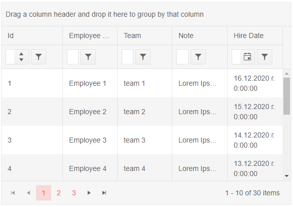

## Environment
<table>
	<tbody>
		<tr>
			<td>Product</td>
			<td>Grid for Blazor, TreeList for Blazor</td>
		</tr>
	</tbody>
</table>


## Description

I am using the TelerikGrid component for Blazor. One of my columns contains a long text, like a description and the Grid wraps it in multiple lines. I would like to prevent that from happening and show the maximum amount of text depending on the column width and after that put an ellipsis (...). 

## Solution

In order to prevent the Grid from wrapping the text in multiple lines you can use CSS and target the `<td>` HTML tags, which contain the data. In order to make that easier you can take advantage of the [OnCellRender event](#oncellrender) that the component exposes. The solution below showcases a sample implementation.


````CSHTML
@*Use the OnCellRender event to pass a custom CSS class to the Grid column and prevent it from wrapping the text in multiple lines for the Notes column*@

<TelerikGrid Data="@MyData" Height="400px"
             Pageable="true" Sortable="true" Groupable="true"
             FilterMode="Telerik.Blazor.GridFilterMode.FilterRow"
             Resizable="true" Reorderable="true">
    <GridColumns>
        <GridColumn Field="@(nameof(SampleData.Id))" Width="120px" />
        <GridColumn Field="@(nameof(SampleData.Name))" Title="Employee Name" Groupable="false" />
        <GridColumn Field="@(nameof(SampleData.Team))" Title="Team" />
        <GridColumn Field="@(nameof(SampleData.Note))" Title="Note" OnCellRender="@OnCellRenderHandler" />
        <GridColumn Field="@(nameof(SampleData.HireDate))" Title="Hire Date" />
    </GridColumns>
</TelerikGrid>

@code {
    void OnCellRenderHandler(GridCellRenderEventArgs args)
    {
        args.Class = "custom-ellipsis";
    }

    public IEnumerable<SampleData> MyData = Enumerable.Range(1, 30).Select(x => new SampleData
    {
        Id = x,
        Name = "Employee " + x,
        Team = "team " + x % 5,
        Note = "Lorem Ipsum is simply dummy text of the printing and typesetting industry. Lorem Ipsum has been the industry's standard dummy text ever since the 1500s, when an unknown printer took a galley of type and scrambled it to make a type specimen book. It has... ",
        HireDate = DateTime.Now.AddDays(-x).Date
    });

    public class SampleData
    {
        public int Id { get; set; }
        public string Name { get; set; }
        public string Team { get; set; }
        public string Note { get; set; }
        public DateTime HireDate { get; set; }
    }
}

<style>
    .custom-ellipsis {
        overflow: hidden;
        max-height: 60px;
        text-overflow: ellipsis;
        white-space: nowrap;
    }
</style>
````

>caption The result from the code snippet above



## See also

* [Knowledge-Base article: Long text in TreeList does not align with the corresponding level]()


