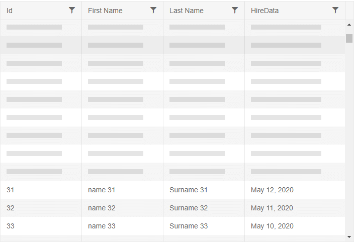

## Environment
<table>
	<tbody>
		<tr>
			<td>Product</td>
			<td>Grid for Blazor</td>
		</tr>
	</tbody>
</table>


## Description
I have a Grid with [Virtual Scrolling]() enabled. When I scroll up or down the rows for the current view port are not rendered as the loading indicator remains visible as shown in the image below.

>caption A depiction of the problem and symptom




## Possible Cause

There are several common causes for that behavior:

* The rendered row height in the browser does not match the value set to the `RowHeight` parameter of the Grid. This depends on the used Theme and / or custom CSS rules applied to the `<tr>` HTML tag.

* The `RowHeight` parameter changes on runtime. Changing the height of the row dynamically depending on the content will cause issues with the virtualization logic.

* The browser and monitor settings do not match the settings of the Grid. Different browser zoom levels and monitor DPI (not set to 100%) can cause the browser to render the rows with unexpected dimensions and / or non-integer values of the `<tr>`.

>caption Typical PROBLEMATIC example when using Virtual Scrolling

````RAZOR
@*This example showcases typical situation when the Virtual Scrolling will break*@

<TelerikGrid Data=@GridData
             ScrollMode="@GridScrollMode.Virtual"
             Height="480px" 
             
             RowHeight="20"
             
             PageSize="20" Sortable="true" FilterMode="@GridFilterMode.FilterMenu">
    <GridColumns>
        <GridColumn Field="Id" />
        <GridColumn Field="Name" Title="First Name" />
        <GridColumn Field="LastName" Title="Last Name" />
        <GridColumn Field="HireData" Width="200px">
            <Template>
                @((context as SampleData).HireDate.ToString("MMMM dd, yyyy"))
            </Template>
        </GridColumn>
    </GridColumns>
</TelerikGrid>

@code {
    public List<SampleData> GridData { get; set; }

    protected override async Task OnInitializedAsync()
    {
        GridData = await GetData();
    }

    private async Task<List<SampleData>> GetData()
    {
        return Enumerable.Range(1, 1000).Select(x => new SampleData
        {
            Id = x,
            Name = $"name {x}",
            LastName = $"Surname {x}",
            HireDate = DateTime.Now.Date.AddDays(-x)
        }).ToList();
    }

    public class SampleData
    {
        public int Id { get; set; }
        public string Name { get; set; }
        public string LastName { get; set; }
        public DateTime HireDate { get; set; }
    }
}
````


## Solution
Set the `RowHeight` parameter to a fixed value in pixels so that it accommodates the content (depending on the content, padding, margins, font-size and other rules and settings on your app such the Theme and CSS related rules) and matches the monitor and browser settings.

You can read more in the [Notes section of the Virtual Scrolling article]().
