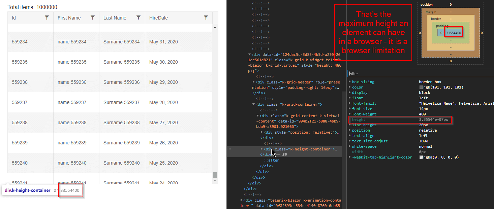

## Environment
<table>
	<tbody>
		<tr>
			<td>Product</td>
			<td>Grid for Blazor</td>
		</tr>
	</tbody>
</table>


## Description
The virtual grid breaks when there are more than 3.000.000 records in TotalCount.

I cannot see all records in the grid with virtual scrolling when there are many records.

I cannot scroll to the end of the records when I have many records.

## Steps to Reproduce
Sample reproducible - try dragging the scrollbar to the end - you won't see record number 1 000 000

````CSHTML
Total items: @GridData.Count

<TelerikGrid Data=@GridData
             ScrollMode="@GridScrollMode.Virtual"
             Height="480px" RowHeight="60" PageSize="20"
             Sortable="true" FilterMode="@GridFilterMode.FilterMenu">
    <GridColumns>
        <GridColumn Field="Id" />
        <GridColumn Field="Name" Title="First Name" />
        <GridColumn Field="LastName" Title="Last Name" />
        <GridColumn Field="HireDate" Width="200px" DisplayFormat="{0:MMMM dd, yyyy}" />
    </GridColumns>
</TelerikGrid>

@code {
    public List<SampleData> GridData { get; set; }

    protected override async Task OnInitializedAsync()
    {
        GridData = await GetData();
    }

    private async Task<List<SampleData>> GetData()
    {
        return Enumerable.Range(1, 1000000).Select(x => new SampleData
        {
            Id = x,
            Name = $"name {x}",
            LastName = $"Surname {x}",
            HireDate = DateTime.Now.Date.AddDays(-x % 1000)
        }).ToList();
    }

    public class SampleData
    {
        public int Id { get; set; }
        public string Name { get; set; }
        public string LastName { get; set; }
        public DateTime HireDate { get; set; }
    }
}
````

## Cause\Possible Cause(s)
Browsers have a limitation on how large (tall or wide) an element can be. This limits how much data you can fit and how far the user can scroll.

The height of the actual grid data element is `total records count` x `row height`. For example, with 60px row height, 1 million records will be 60 000 000 pixels.

Browsers can usually go up to about 33 000 000 pixels.

Thus, the scrollbar can only get so small, and you can only scroll to a certain extent of the data.

>caption Screenshot explaining the browser limitation that does not allow the user to scroll far enough



## Solution
The only possible solution if you have so many records is to use the standard [paging]().
