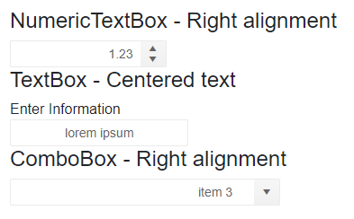

## Environment

<table>
    <tbody>
        <tr>
            <td>Product</td>
            <td>
                AutoComplete for Blazor,<br />
                ComboBox for Blazor<br />
                DatePicker for Blazor<br />
                DateTimePicker for Blazor<br />
                NumericTextBox for Blazor,<br />
                TextBox for Blazor,<br />
                TimePicker for Blazor
            </td>
        </tr>
    </tbody>
</table>

## Description

How to align the text to the right or center in my inputs (such as textbox and numeric textbox).

## Solution

You can use [standard CSS customizations](slug:themes-override) for inputs in the Telerik UI for Blazor. To make cascading of the styles easier, use the `Class` parameter and pass a custom CSS class. Use the `text-align` rule with a suitable selector.

The example below shows how to align a numeric textbox and a combo box to the right, and how to align a textbox to the center.

>caption Change the text alignment for inputs in Telerik UI for Blazor

````RAZOR
@* right align and center align text in inputs *@

<style>
    .myNumericTextbox .k-input-inner,
    .myCombobox .k-input-inner {
        text-align: right;
    }

    .myTextbox .k-input-inner {
        text-align: center;
    }
</style>

<h4>NumericTextBox - Right alignment</h4>
<TelerikNumericTextBox @bind-Value="@theValue" Class="myNumericTextbox"></TelerikNumericTextBox>

<h4>TextBox - Centered text</h4>
<TelerikTextBox @bind-Value="theTbValue" Class="myTextbox"></TelerikTextBox>

<h4>ComboBox - Right alignment</h4>
<TelerikComboBox Data="@myComboData" TextField="MyTextField" ValueField="MyValueField" @bind-Value="selectedValue"
                 Placeholder="Select an item..." ShowClearButton="true" Filterable="true" Class="myCombobox">
</TelerikComboBox>


@code {
    decimal theValue { get; set; } = 1.234m;
    string theTbValue { get; set; } = "lorem ipsum";

    IEnumerable<MyDdlModel> myComboData = Enumerable.Range(1, 20).Select(x => new MyDdlModel { MyTextField = "item " + x, MyValueField = x });

    int selectedValue { get; set; } = 3;

    public class MyDdlModel
    {
        public int MyValueField { get; set; }
        public string MyTextField { get; set; }
    }
}

````

>caption The result from the code snippet above


