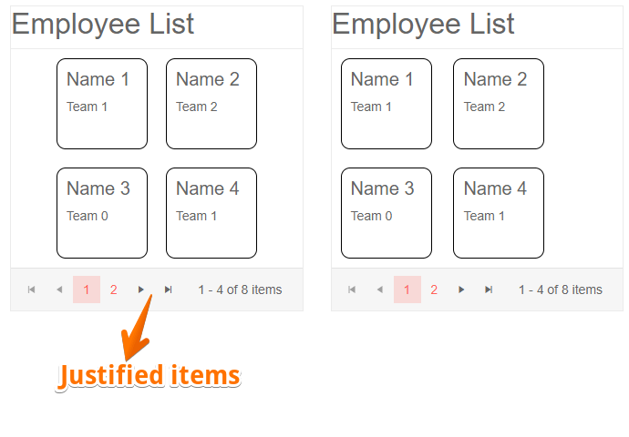

## Environment
<table>
	<tbody>
		<tr>
			<td>Product</td>
			<td>ListView for Blazor</td>
		</tr>
	</tbody>
</table>


## Description
I would like to justify the items of the ListView to the center of the content area.

## Solution

To justify the items of the ListView to the center of the content area you can use some CSS. In order to cascade the rules to a single instance of the ListView, you can use the `Class` parameter that the component exposes. It will add a custom CSS class to the topmost HTML element. 

>caption The result from the code snippet below



````CSHTML
@* Use the Class parameter and some CSS to justify the ListView items to the center of the content area. *@

<style>
    .my-listview .k-listview-content { /* justifies the items in the ListView */
        display: flex;
        flex-wrap: wrap;
        justify-content: center;
    }

    .listview-item { /*those styles are to create the layout of the listview item.*/
        height: 100px;
        width: 100px;
        display: inline-block;
        margin: 10px;
        border: 1px solid black;
        border-radius: 10px;
        padding: 10px;
    }
</style>


<div class="row">
    <div class="col-6">
        <TelerikListView Data="@ListViewData" 
                         Pageable="true"
                         PageSize="4"
                         Class="my-listview">
            <HeaderTemplate>
                <h2>Employee List</h2>
            </HeaderTemplate>
            <Template>
                <div class="listview-item">
                    <h5>@context.Name</h5>
                    <div>@context.Team</div>
                </div>
            </Template>
        </TelerikListView>
    </div>
    <div class="col-6">
        <TelerikListView Data="@ListViewData" 
                         Pageable="true"
                         PageSize="4">
            <HeaderTemplate>
                <h2>Employee List</h2>
            </HeaderTemplate>
            <Template>
                <div class="listview-item">
                    <h5>@context.Name</h5>
                    <div>@context.Team</div>
                </div>
            </Template>
        </TelerikListView>
    </div>
</div>


@code{
    List<SampleData> ListViewData { get; set; } = Enumerable.Range(1, 8).Select(x => new SampleData
    {
        Id = x,
        Name = $"Name {x}",
        Team = $"Team {x % 3}"
    }).ToList();

    public class SampleData
    {
        public int Id { get; set; }
        public string Name { get; set; }
        public string Team { get; set; }
    }
}
````
