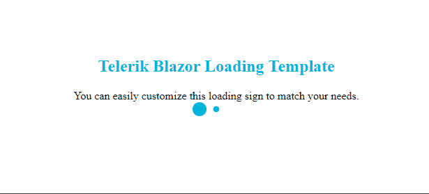

## Description

While the client-side Blazor app is loading and spinning up, you may want to show a beautiful loading message to your users so they know something is happening.



## Solution

To have a loading sign in a Blazor app, you must use HTML and CSS and put the desired content inside the `app` element. The Blazor framework will remove its contents and replace them with the actual application once it has fully loaded.

The loading message cannot be a Blazor component, because it is shown before the actual SPA has initialized in the browser.

>caption A sample collection of HTML and CSS that provides a loading message for a client-side Blazor app. Place this in your `wwwroot/index.html` file.

````
<!DOCTYPE html>
<html>
<head>
	<style>
	    /* This CSS is specific to the current HTML. 
	        Note that this snippet only contains the necessary changes and not the full Blazor app template */
		.loading-section {
			text-align: center;
			height: 80vh;
			display: flex;
			flex-direction: column;
			justify-content: center;
		}

			.loading-section h2 {
				color: #00b5dc;
			}

		.loader-dot {
			height: 20px;
			width: 20px;
			border-radius: 50%;
			background-color: #00b5dc;
			display: inline-block;
			-webkit-animation: grow 2.1s infinite ease-in-out both;
			animation: grow 2.1s infinite ease-in-out both;
		}

			.loader-dot.dot1 {
				-webkit-animation-delay: -0.96s;
				animation-delay: -0.96s;
			}

			.loader-dot.dot2 {
				-webkit-animation-delay: -0.48s;
				animation-delay: -0.48s;
			}

		@-webkit-keyframes grow {
			0%, 80%, 100% {
				-webkit-transform: scale(0)
			}

			40% {
				-webkit-transform: scale(1.0)
			}
		}
	</style>
</head>
<body>
	<app>
		<div class="loading-section">
			<h2>Telerik Blazor Loading Template</h2>
			<div class="short-description">You can easily customize this loading sign to match your needs.</div>
			<div class="loader mt-5">
				<div class="loader-dot dot1"></div>
				<div class="loader-dot dot2"></div>
				<div class="loader-dot dot3"></div>
			</div>
		</div>
	</app>
</body>
</html>
````

>tip You can put this CSS in your existing stylesheet. You can also customize the code, contents and appearance so they match your application design. You can even write it up using a pre-processor like SASS and take colors and variales from your main styles.

