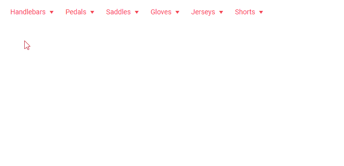

## Description

I have setup a [Menu]() in my Telerik Blazor Application. When the component is hosted and the user hovers quickly over the menu items they would not always close.

>caption The menu items do not close when the user hovers quickly over them

>note This issue should be fixed in the 2.23.0 release https://feedback.telerik.com/blazor/1428330-multiple-parent-menu-items-can-be-expanded-at-the-same-time
   
## Cause\Possible Cause(s)

This behavior is (mainly) observed when the application uses the `Blazor Server` hosting model. It occurs mostly due to high network latency to the server which hosts the project because every user interaction involves a network hop (passing one data package from one network segment to the next). 

The SignalR connection is asynchronous and the large volume of quick events are not guaranteed to arrive in the same order as they are sent, which can cause issues with the circuit state - the server will receive wrongly ordered packets and events and can render wrong popups, thinking previous ones are not open or are already closed.

A common reason for such a problem is that WebSockets are not enabled on the hosting server (most common in cloud hosting such as Azure, where they are turned off by default).

Another common cause is the usage of a VPN to access the server - such tools often add a lot of latency to the network calls, and that is very detrimental to the server-side Blazor flavor.

You can see the following MSDN article on measuring the latency your users have: <a href="https://docs.microsoft.com/en-us/aspnet/core/blazor/host-and-deploy/server?view=aspnetcore-3.1#measure-network-latency" target="_blank">https://docs.microsoft.com/en-us/aspnet/core/blazor/host-and-deploy/server?view=aspnetcore-3.1#measure-network-latency</a>. It cites around 250ms as a reasonable delay, yet 
such large latency can be tolerated only for simple interactions like button clicks. Mouseover interactions like menus or tooltips need to be much much faster in order to not feel sluggish to the user. Moreover, with many mouseover events happening, large latency increases dramatically the chance of SignalR packets arriving out of order which is the underlying reason for such problems. 

For example, in 150ms latency between the first mouseover and the server response with the new DOM, the user can move over a few more menu elements, which sends several instructions to the server (mouseout from the previous and mouseover on the next for each new element), one of which might come back before the original instruction, or some other order. The more the user moves the mouse, the more jitter appears in these instructions and events can get out of order.

## Solution

A solution to this would be using the `Blazor WebAssembly` hosting model. That would remove the latency factor since the content of the application is executed on the device of the user.

Any other option that lowers the user latency to reasonable values for the server-side Blazor model can also resolve the problem.