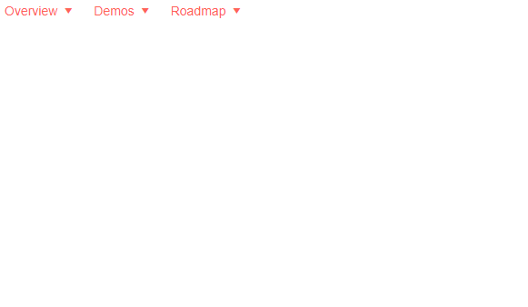

## Environment
<table>
	<tbody>
		<tr>
			<td>Product</td>
			<td>Menu for Blazor</td>
		</tr>
	</tbody>
</table>


## Description
How can I create a large structured menu? I want the dropdown to be big and to contain many items instead of one item per row.



## Solution
You can use the ItemTemplate of the menu to render the desired content and layout.

To avoid the expand arrows, make sure you have no further child items for the items you want to make into a mega-menu. You may also want to add a bit of CSS to remove the built-in paddings on nested menu items so you can have full control over the layout and colors.

>caption A structured mega-menu dropdown

````CSHTML
@* This sample shows how you can make a mega menu with the Telerik Menu
    The key point is to have only one level of nesting so that the mega menu item
    does not render the expand arrow to indicate child items exist,
    and then a bit of CSS to remove the default padding for full control*@

<TelerikMenu Data="@MenuItems">
    <ItemTemplate>
        @{
            MenuItem currItem = context as MenuItem;
            if (currItem.ParentId == null) // root level items get their text rendered
            {
                @currItem.Text
            }
            else // for child items we render the mega menu
            {
                <div style="width: 400px; height: 300px; background: yellow; padding: 2rem;">
                    <h6>@currItem.Text</h6>
                    <p style="white-space: normal">
                        This here would often be a separate component
                        or otherwise use metadata from the model to render
                        the desired HTML structure and layout.
                        Here, we just add some text and let the parent element provide
                        dimensions that will stretch the menu item. In a real app
                        you can refactor this as needed - use more child elements
                        of this node, other metadata, components and so on.
                    </p>
                </div>
            }
        }
    </ItemTemplate>
</TelerikMenu>

<style>
    /* we use this to style the menu items in popups so you don't see the built-in background
    so you can ahve full control over the layout and colors of the mega menu items */
    .k-menu-popup .k-menu-item .k-link {
        padding: 0;
    }
</style>

@code {
    // just sample data binding
    public List<MenuItem> MenuItems { get; set; }

    // this model uses the default field name for the menu
    public class MenuItem
    {
        public int Id { get; set; }
        public int? ParentId { get; set; }
        public string Text { get; set; }
    }

    protected override void OnInitialized()
    {
        MenuItems = new List<MenuItem>()
        {
            new MenuItem()
            {
                Id = 1,
                Text = "Overview"
            },
            new MenuItem()
            {
                Id = 2,
                Text = "Demos"
            },
            new MenuItem()
            {
                Id = 3,
                Text = "Roadmap"
            },
            // sample models for the nested mega dropdowns
            // there should be only one child per root-level item for best results
            new MenuItem()
            {
                Id = 4,
                ParentId = 1,
                Text = "Products",
            },
            new MenuItem()
            {
                Id = 5,
                ParentId = 2,
                Text = "Demo List",
            },
            new MenuItem()
            {
                Id = 6,
                ParentId = 3,
                Text = "What's new",
            },
        };

        base.OnInitialized();
    }
}
````
