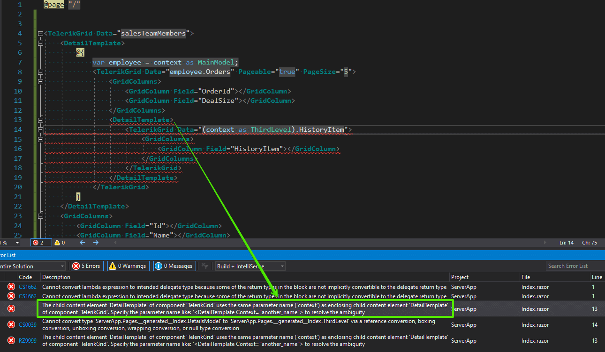

## Description

When nesting components, you will usually do that under tags of type `RenderFragment`. For example, the `DetailTemplate` of a grid to get [multi-level hierarchy]().

## Problem

Once you do that, your code will no longer compile with a set of errors where the important two are:

> `Cannot convert lambda expression to intended delegate type because some of the return types in the block are not implicitly convertible to the delegate return type`

followed by

> `The child content element 'DetailTemplate' of component 'TelerikGrid' uses the same parameter name ('context') as enclosing child content element 'DetailTemplate' of component 'TelerikGrid'. Specify the parameter name like: '<DetailTemplate Context="another_name"> to resolve the ambiguity`



## Solution

Use named `context` variables. Each `RenderFragment` property should expose a `Context` parameter that lets you choose a name for the argument that its children will receive. Not only does this let you nest the same tags inside one another, it also resolves the type of the context data.

>caption Example of using named Context variables or nesting DetailTemplate RenderFragment elements

````CSHTML
@* See the DetailTemplate tags and their Context parameters. This snippet is not fully runnable, it only showcases the concept. You do not have to name all the context variables, as long as all of them have unique names (usually you could leave one to use the default name, but I recomment naming all of them when nesting RenderFragments) *@

<TelerikGrid Data="salesTeamMembers">
    <DetailTemplate Context="employeeItem">
        @{
            var employee = employeeItem as MainModel;
            <TelerikGrid Data="employee.Orders" Pageable="true" PageSize="5">
                <GridColumns>
                    <GridColumn Field="OrderId"></GridColumn>
                    <GridColumn Field="DealSize"></GridColumn>
                </GridColumns>
                <DetailTemplate Context="orderInfo">
                    <TelerikGrid Data="orderInfo.ShippingHistory">
                        <GridColumns>
                            <GridColumn Field="HistoryItem"></GridColumn>
                        </GridColumns>
                    </TelerikGrid>
                </DetailTemplate>
            </TelerikGrid>
        }
    </DetailTemplate>
    <GridColumns>
        <GridColumn Field="Id"></GridColumn>
        <GridColumn Field="Name"></GridColumn>
    </GridColumns>
</TelerikGrid>
````
