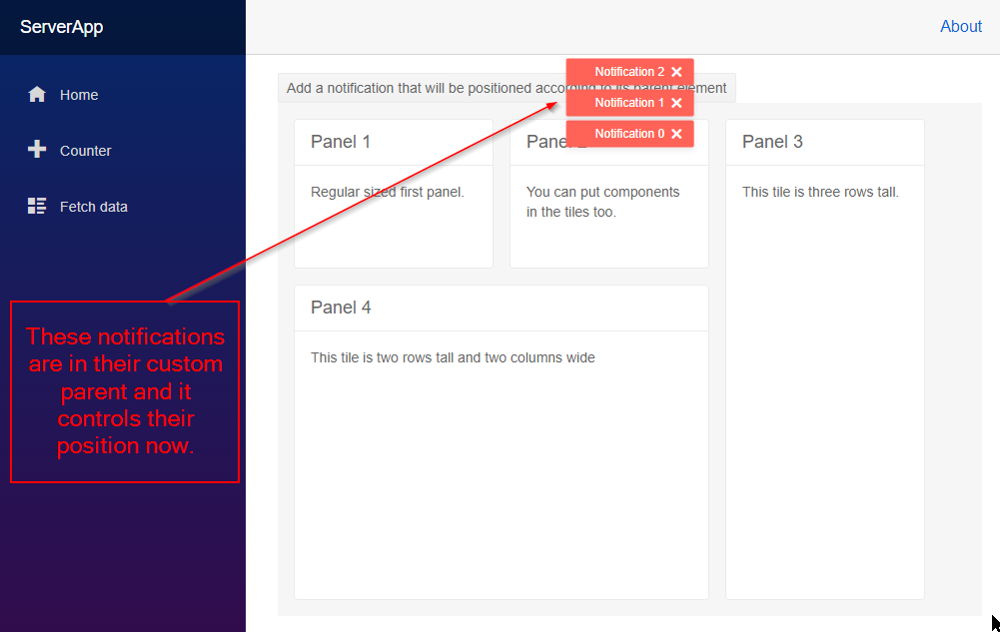

## Environment
<table>
	<tbody>
		<tr>
			<td>Product</td>
			<td>Notification for Blazor</td>
		</tr>
	</tbody>
</table>


## Description
I have a top-menu and would like to be able to adjust the notification so it is displayed below the menu, like setting margin-top to -18px.

I want to customize the position of the notification to be different from the default options that are relative to the viewport. I want the notifications in an area of the page I choose.

## Solution
You can wrap the notification in an element from your app (such as a `<div>`) and, through the `Class` the notification exposes, you can define CSS rules that put the notifications in that container so they respect its own offsets and position in your layout.



>caption Custom notification position through a wrapping element

````CSHTML
@* Use parent elements and CSS to set the custom position of the notifications *@

<style>
    .custom-notification-parent {
        position: absolute; /* lets the notifications use this parent for positioning */
        left: 50%;
        top: 50%;
        transform: translate(-50%, -50%);
        z-index: 1234;
        /* you may also want to set z-index or other rules here depending on your needs
        This example centers the notification container according to its own parent which is
        between the button and the tile layout in this snippet
        Centering approach taken from https://css-tricks.com/centering-css-complete-guide/
        */
    }

    .custom-positioned-notifications {
        position: relative; /*make the container for the individual notifications respect the position of its parent*/
        flex-wrap: nowrap !important; /*override the default setting from the component - this lets the individual notifications stay in a column instead of breaking out into two columns*/
    }
</style>

<TelerikButton OnClick="@AddNotification">Add a notification that will be positioned according to its parent element</TelerikButton>

<div style="position: relative">
    <div class="custom-notification-parent">
        <TelerikNotification Class="custom-positioned-notifications"
                             @ref="@NotificationReference"
                             HorizontalPosition="@NotificationHorizontalPosition.Center"
                             VerticalPosition="@NotificationVerticalPosition.Top">
        </TelerikNotification>
    </div>
</div>

<TelerikTileLayout Columns="3"
                   ColumnWidth="200px"
                   RowHeight="150px"
                   Resizable="true"
                   Reorderable="true">
    <TileLayoutItems>
        <TileLayoutItem HeaderText="Panel 1">
            <Content>Regular sized first panel.</Content>
        </TileLayoutItem>
        <TileLayoutItem HeaderText="Panel 2">
            <Content>You can put components in the tiles too.</Content>
        </TileLayoutItem>
        <TileLayoutItem HeaderText="Panel 3" RowSpan="3">
            <Content>This tile is three rows tall.</Content>
        </TileLayoutItem>
        <TileLayoutItem HeaderText="Panel 4" RowSpan="2" ColSpan="2">
            <Content>This tile is two rows tall and two columns wide</Content>
        </TileLayoutItem>
    </TileLayoutItems>
</TelerikTileLayout>

@code {
    TelerikNotification NotificationReference { get; set; }
    int counter { get; set; }
    public void AddNotification()
    {
        NotificationReference.Show(new NotificationModel()
        {
            Text = $"Notification {counter++}",
            ThemeColor = "primary",
            Closable = true,
            CloseAfter = 0
        });
    }
}
````

## Notes
* Keep in mind that the container for the notifications might consume mouse clicks, selection or otherwise interfere with the UX of your app. Thus, style and size it accordingly.

* You can inspect the rendered content to see what the built-in CSS rules and HTML structure are, so you can tweak this example further to fit your needs.

* @[template](/_contentTemplates/notification/templates.md#one-instance-per-app-link)