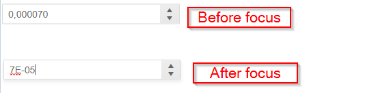

## Environment
<table>
	<tbody>
		<tr>
			<td>Product</td>
			<td>NumericTextBox for Blazor</td>
		</tr>
	</tbody>
</table>


## Description
When I try to update a value, the numeric textbox automatically transforms the value into the equivalent scientific notation, but I need to keep the decimal notation of the value.



## Steps to Reproduce
Use a sufficiently small number and bind it to the Numeric Textobox, then focus it.

````CSHTML
@* the key thing is the small value below, and the type - double *@

<TelerikNumericTextBox Decimals="6" @bind-Value="@Performance" Format="@format"></TelerikNumericTextBox>

@code{
    double Performance { get; set; } = 0.000070;

    string format = "#0.000000";

    protected override void OnInitialized()
    {
        //this will show the scientific notation in the console too
        Console.WriteLine(Performance);

        base.OnInitialized();
    }
}
````

## Cause\Possible Cause(s)

Sufficiently small (or large) numbers may be rendered as strings by the framework in scientific notation (see the example above).

The Telerik Numeric Textbox renders the `Format` parameter when it is not focused through a simple `.ToString(Format)` call, but when focused, it needs to take into account the `Decimals` and so it has to round the value before calling `.ToString()` to it to render it in the input.

This rounding makes types with lower precision (such as `double`) show up in sceintific notation (such as `7E-05`) instead of the expected decimal notation (such as `0.000070`) while the `Format` may be set to something that does not manifest this behavior and thus mask the problem.

You can find a sample approximation of the rounding code at the time of writing here:

````CSHTML
non-focused:
@Performance.ToString(format)
<br />
focused:
@RoundDouble(Performance, decimals)
<br />
<TelerikNumericTextBox Decimals="@decimals" @bind-Value="@Performance" Format="@format"></TelerikNumericTextBox>

@code{
    double Performance { get; set; } = 0.000070;

    string format = "#0.000000";
    int decimals = 6;

    public double RoundDouble(double value, int decimals)
    {
        return (double)(object)Math.Round((double)(object)value, decimals);
    }
}
````

## Solution
Use a type with sufficient precision that will still be rendered by the framework in decimal notation at the desired precision levels, such as `decimal`.


````CSHTML
non-focused:
@Performance.ToString(format)
<br />
focused:
@RoundDecimal(Performance, decimals)
<br />
<TelerikNumericTextBox Decimals="@decimals" @bind-Value="@Performance" Format="@format"></TelerikNumericTextBox>

@code{
    decimal Performance { get; set; } = 0.000070m;

    string format = "#0.000000";
    int decimals = 6;

    public decimal RoundDecimal(decimal value, int decimals)
    {
        return (decimal)(object)Math.Round((decimal)(object)value, decimals);
    }
}
````

