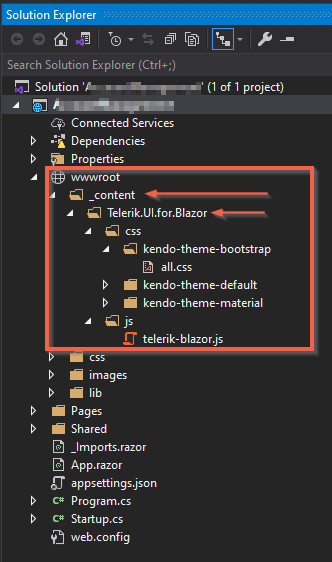

## Description

 I suddenly started getting the following error 

>caution **The static web asset** 'C:\Users\____\.nuget\packages\telerik.ui.for.blazor\2.20.0\build\..\staticwebassets\css\kendo-theme-bootstrap\all.css' **has a conflicting web root path** '/wwwroot/_content/Telerik.UI.for.Blazor/css/kendo-theme-bootstrap/all.css' **with the project file 'wwwroot\_content\Telerik.UI.for.Blazor\css\kendo-theme-bootstrap\all.css'**. C:\Program Files\dotnet\sdk\5.0.100\Sdks\Microsoft.NET.Sdk.Razor\build\netstandard2.0\Microsoft.NET.Sdk.Razor.StaticWebAssets.targets	208	

 

I cleaned the project, I also cleared the nuget packages cache but I am still getting these errors.

## Cause\Possible Cause(s)

The issue is that the project has the `_content` folder in the `wwwroot` folder and the Telerik static assets are copied there.

## Solution

Delete the `_content` folder from your `wwwroot` folder.

The framework creates that folder build-time, and copies the static assets from the various packages you use to that folder automatically. So, you should not create and use it in your own project.

