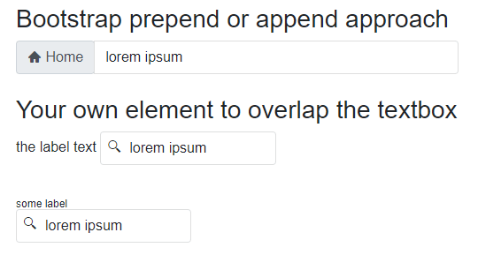

## Environment
<table>
	<tbody>
		<tr>
			<td>Product</td>
			<td>TextBox for Blazor</td>
		</tr>
         <tr>
            <td>Product Version</td>
            <td>5.0.1 and older</td>
        </tr>
	</tbody>
</table>


## Description

I would like to add a icon in the TextBox, like a search icon, or email or phone. 

Is there anyway to do an 'addon' button with the TelerikTextBox?

## Solution

>tip As of **UI for Blazor 5.1.0**, you may use [Prefix and Suffix templates](https://docs.telerik.com/blazor-ui/common-features/input-adornments) to add the desired content as prefix or suffix to the TextBox.

TextBoxes (`<input>` elements) can only hold plain text. It is possible to render an icon next to the textbox and position it over the textbox. The `<input>` element itself will need some left padding to free space for the icon.

>caption Display icon over TextBox input

````RAZOR
<p>
    <label>
        Fixed Label
        <span class="tb-icon-container">
            <TelerikSvgIcon Icon="@SvgIcon.Search" />
            <TelerikTextBox @bind-Value="@StringValue" Width="200px" />
        </span>
    </label>
</p>

<p>
    <span class="tb-icon-container with-label">
        <TelerikSvgIcon Icon="@SvgIcon.Search" />
        <TelerikFloatingLabel Text="Floating Label">
            <TelerikTextBox @bind-Value="@StringValue" Width="200px" />
        </TelerikFloatingLabel>
    </span>
</p>

<style>
    /* enable absolute position for the icon */
    .tb-icon-container {
        position: relative;
    }

    /* position icon over textbox */
    .tb-icon-container .k-icon {
        position: absolute;
        z-index: 1;
        top: 0;
        left: 0.5em;
    }

    /* add space to textbox without floating label */
    .tb-icon-container .k-textbox input,
    /* add space to floating label over the textbox */
    .k-floating-label-container.k-empty:not(.k-focus) .k-label {
        padding-left: 2em;
    }

    /* icon with floating label */
    .tb-icon-container.with-label .k-icon {
        top: 0.7em;
    }
</style>

@code{
    string StringValue { get; set; } = "lorem ipsum";
}
````

### Version 2.30 and Older

[UI for Blazor 3.0 changed the HTML rendering of input components](slug:changes-in-3-0-0#rendering-and-themes). For older versions use the code below.



>caption How to add icon to the textbox

````RAZOR
<h3>Bootstrap prepend or append approach</h3>

<div style="width: 500px;">
    <div class="form-group">
        <div class="input-group">
            <div class="input-group-prepend">
                <label for="theTb">
                    <span class="input-group-text">
                        <TelerikSvgIcon Icon="@SvgIcon.Home" />
                        &nbsp;Home
                    </span>
                </label>
            </div>
            <TelerikTextBox Class="form-control" @bind-Value="@TheText" Id="theTb" />
        </div>
    </div>
</div>


<h3>Your own element to overlap the textbox</h3>


<label>
    the label text
    <span class="tb-icon-container">
        @* Use the desired icons and styling here, 
            if you use a little more complex markup you could even 
            add event handlers to make this into a button *@
        <TelerikSvgIcon Icon="@SvgIcon.Search" />
        <TelerikTextBox @bind-Value="@TheText" />
    </span>
</label>

<br />
<br />
<span class="tb-icon-container with-label">
    <TelerikSvgIcon Icon="@SvgIcon.Search" />
    <TelerikTextBox @bind-Value="@TheText" />
</span>
<style>
    .tb-icon-container {
        position: relative;
    }

        /* these rules position the icon. Update with your own selector if you add HTML elements for click events */
        .tb-icon-container .k-icon {
            position: absolute;
            z-index: 1;
            top: 0;
            left: 0.5em;
        }

        /* no floating label */
        .tb-icon-container input.k-textbox,
        /* for the floating label */
        .tb-icon-container .k-textbox input,
        .tb-icon-container .k-state-empty .k-label {
            padding-left: 2em;
        }

        /* this rule also positions the icon for the floating label scenario, tweak it with your own selectors if you use other HTML */
        .tb-icon-container.with-label .k-icon {
            top: 0.5em;
        }
</style>

@code{
    string TheText { get; set; } = "lorem ipsum";
}
````
