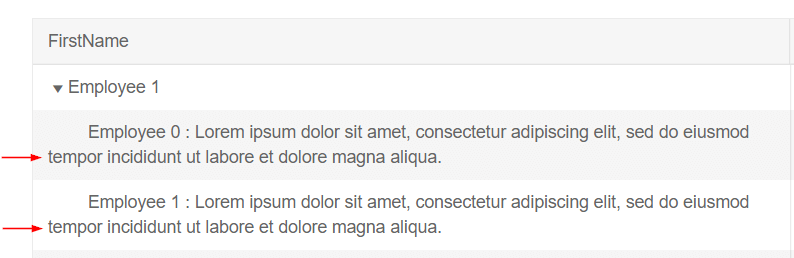
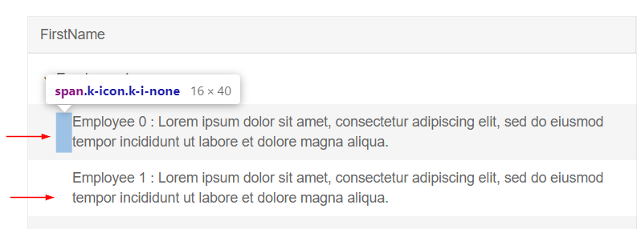

## Environment
<table>
	<tbody>
		<tr>
			<td>Product Version</td>
			<td>2.20.0</td>
		</tr>
		<tr>
			<td>Product</td>
			<td>TreeList for Blazor</td>
		</tr>
	</tbody>
</table>


## Description
When a text is longer than the column width, it does a line break but the next line doesn't take into account the depth level and starts at the very left.




## Solution

The following example showcases a CSS workaroud for the decribed behavior.

To achieve the proper aligning when dealing with longer text in the child level do the following:

1. Use the `Class` parameter to set a CSS class to the TreeList and cascade its elements
1. Create a CSS class setting a defeult height and add it to the row OnCellRender
1. Child hierarchy levels padding is achieved through hidden spans with classes `k-icon` and `k-i-none`. Use those classes along with the TreeList class to casecade the spans and expand their height to 100% and float to left.



````CSHTML

@*Align the child element text with custom CSS*@

<style>
    .MyTreeList .defaultHeight {
        height: 50px;
    }

    .MyTreeList .k-icon.k-i-none {
        float: left;
        height: 100%;
    }
</style>

<TelerikTreeList Data="@Data"
                 @ref="@TreeListRef"
                 IdField="EmployeeId"
                 ParentIdField="ReportsTo"
                 Pageable="true"
                 Class="MyTreeList">
    <TreeListColumns>
        <TreeListColumn OnCellRender="@( (TreeListCellRenderEventArgs e) => e.Class="defaultHeight" )"  
                        Field="FirstName" Expandable="true">
        </TreeListColumn>
        <TreeListColumn Field="EmployeeId"></TreeListColumn>
    </TreeListColumns>
</TelerikTreeList>

@code {
    TelerikTreeList<Employee> TreeListRef { get; set; }
    public List<Employee> Data { get; set; }

    public class Employee
    {
        public int EmployeeId { get; set; }
        public string FirstName { get; set; }
        public int? ReportsTo { get; set; }
    }

    protected override void OnInitialized()
    {
        Data = new List<Employee>();
        var rand = new Random();
        int currentId = 1;

        for (int i = 1; i < 3; i++)
        {
            Data.Add(new Employee()
            {
                EmployeeId = currentId,
                ReportsTo = null,
                FirstName = "Employee  " + i.ToString()
            });

            currentId++;
        }
        for (int i = 1; i < 3; i++)
        {
            for (int j = 0; j < 2; j++)
            {
                Data.Add(new Employee()
                {
                    EmployeeId = currentId,
                    ReportsTo = i,
                    FirstName = "Employee " + j.ToString() + " : Lorem ipsum dolor sit amet, consectetur adipiscing elit, sed do eiusmod tempor incididunt ut labore et dolore magna aliqua. "
                });
                currentId++;
            }
        }
    }
}
````

