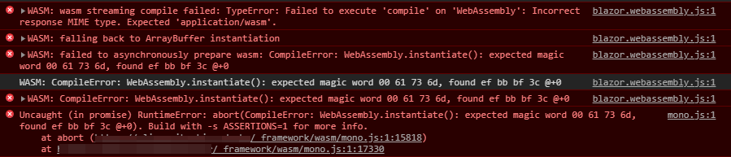

## Environment
<table>
	<tbody>
	    <tr>
			<td>Hosting</td>
			<td>cloudflare.com integration with smarterasp.net, may affect others</td>
		</tr>
		<tr>
			<td>Environment</td>
			<td>WASM Blazor app</td>
		</tr>
	</tbody>
</table>

## Description
Publishing a client-side (WASM) Blazor app may fail with messages similar to the error below.

A particular environment is an ASP.NET Core hosted Blazor project hosted on smarterAsp.net with the automatic config which enabled caching and compacting with cloudflare.com.

## Error Message
* WASM: wasm streaming compile failed: Failed to execute 'compile' on 'WebAssembly': Incorrect response MIME type. Expected 'application/wasm'
* WASM: failed to asynchronously prepare wasm: CompileError: WebAssembly.instantiate(): expected magic word 00 61 73 6d, found ef bb bf 3c @+0
* CompileError: WebAssembly.instantiate(): expected magic word 00 61 73 6d, found ef bb bf 3c @+0

## Cause\Possible Cause(s)
The errors indicate the following issues:

* The MIME type for the `wasm` files is wrong - it must be `application/wasm` but the hosting environment used the wrong one
* The wasm file is broken (for example, archived, compressed twice or otherwise truncated/modified).

## Solution
The general solution is to make sure that the application files are not tampered with and that you have the correct server settings as per Microsoft's documentation: [https://docs.microsoft.com/en-us/aspnet/core/host-and-deploy/blazor/webassembly?view=aspnetcore-3.1](https://docs.microsoft.com/en-us/aspnet/core/host-and-deploy/blazor/webassembly?view=aspnetcore-3.1)

In the particular smarterasp.net hosting case, disabling the cloudflare integration resolved the issue.
