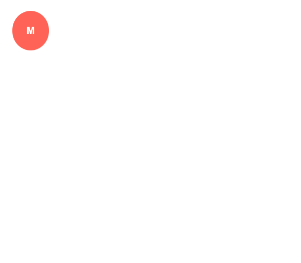

## Environment
<table>
	<tbody>
		<tr>
			<td>Product</td>
			<td>Window for Blazor</td>
		</tr>
	</tbody>
</table>


## Description
Is there any way to collapse a window to the bottom of a page? How to create a responsive modal that can be minimized? How to minimize Modal Window as a chat for messages?

## Solution
To implement a responsible popup that can be minimized to the bottom of the page:

1. Set the `Top` and `Left` parameters to control the position of the modal.
2. Use boolean flags to show and hide the popup.
3. Use the [MediaQuery](https://docs.telerik.com/blazor-ui/components/mediaquery/overview) component to make the modal window responsive.

>caption The result from the code snippet below on a big screen.


>caption The result from the code snippet below on a small screen.



````Razor
@*Responsive minimizable popup.*@

<TelerikMediaQuery Media="(max-width: 960px)" OnChange="((changed) => Small = changed)"></TelerikMediaQuery>

<TelerikWindow Class="@myClass" Modal="@isModal"
               Top="@(Small == true && !isModal ? "100px" : Top)"
               Left="@(Small == true && !isModal ? "300px" : Left)" 
               @bind-Visible="@isModalVisible">
    <WindowTitle>
        <strong>@Title</strong>
    </WindowTitle>
    <WindowContent>
        @if (isModal)
        {
            @Content
        }
    </WindowContent>
    <WindowActions>
        <WindowAction Name="MyMinimizer" Hidden="@(!isModal)" Icon="window-minimize" OnClick="@MyCustomMinimize" />
        <WindowAction Name="MyExpander" Hidden="@isModal" Icon="window" OnClick="@MyCustomExpand" />
    </WindowActions>
</TelerikWindow>

@code {
    bool isModalVisible { get; set; } = true;
    bool isModal { get; set; } = true;
    private bool Small { get; set; }

    string Title => Small == true && !isModal ? "M" : "My Responsive Popup";
    string Content = "---------- Welcome to our Minimized/Collapsed popup! ----------";
    string Top = "40%";
    string Left = "40%";
    string myClass => Small == true && !isModal ? "minimized" : "";

    public void MyCustomMinimize()
    {
        Top = "90%";
        Left = "15%";
        isModal = false;
        StateHasChanged();
    }

    public void MyCustomExpand()
    {
        Top = "40%";
        Left = "40%";
        isModal = true;
        StateHasChanged();
    }
}

@if (!isModal)
{
    <style>
        .k-window-content:last-child {
            display: none;
        }

        .k-window-titlebar {
            border-style: none;
        }

        .minimized {
            background-color: #ff6358;
            color: white;
            display: inline;
            padding: 14px;
            border-bottom-left-radius: 65%;
            border-bottom-right-radius: 65%;
            border-top-left-radius: 65%;
            border-top-right-radius: 65%;
        }
    </style>
}
````
