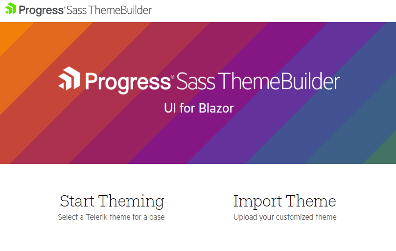
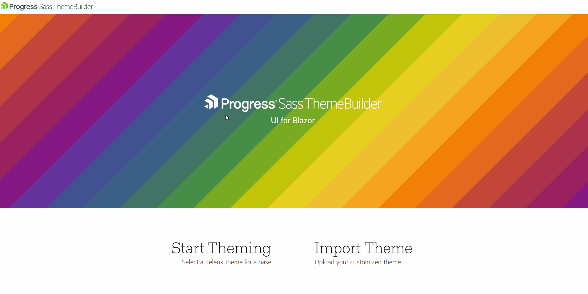
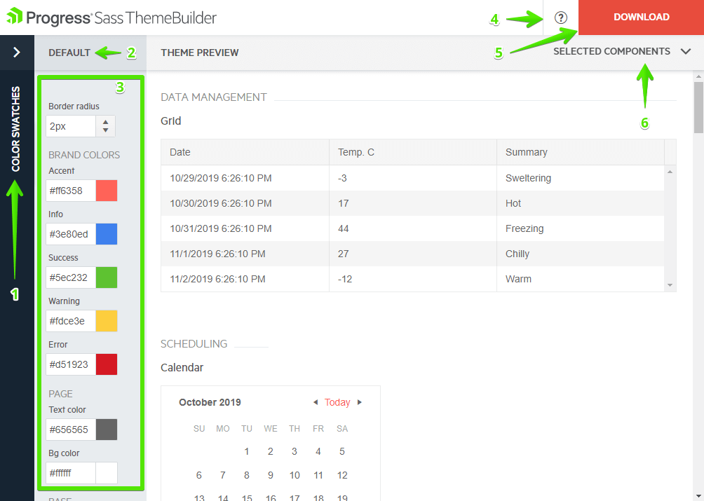
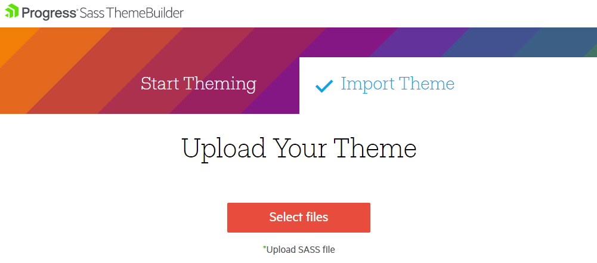

# Custom Themes

By customizing themes you can alter the default appearance of the Telerik components so they match the desired color scheme from your designers and fit with the rest of your site's coloring and style.

This article contains the following sections:


* [Using the Sass Theme Builder](#using-the-sass-theme-builder)
	* [Create New Theme](#create-new-theme)
	* [Modifying Themes](#modifying-themes)
	* [Import Custom Theme](#import-custom-theme)
	* [Use The Custom Theme In Your Project](#use-the-custom-theme-in-your-project)
* [Manual Alternative](#manual-alternative)
	* [Using the Build Process of the Application](#using-the-build-process-of-the-application)
	* [Using the Build Process of the Themes](#using-the-build-process-of-the-themes)
	* [Using Variables](#using-variables)
* [How to Use a Custom Theme I Have](#how-to-use-a-custom-theme-i-have)
* [Contribution](#contribution)


>tip To get theme updates and fixes, re-generate the custom themes from the latest built-in base theme when we release a new version of the suite, or when you upgrade the Telerik components in your project.

## Using the Sass Theme Builder

The Progress [**Sass Theme Builder for Blazor**](https://themebuilder.telerik.com/blazor-ui) is an Angular web application that enables you to create new or customize existing themes.

This article will walk you through the tool and will explain how to use the generated custom theme.

>caption Figure 1: The home screen of the Sass Theme Builder



### Create New Theme

To create a new theme:

1. On the initial Sass Theme Builder pane, select the **Start Theming** option.

1. Choose one of the existing themes to use as a base.

1. Select the components which you intend to style. You can also change the selection at a later stage.

    >caption Figure 2: Selecting a base theme and components
    
    
    
1. Follow the next options in this article to customize the theme

Complex Telerik UI for Blazor components, such as the Grid, rely on other components to deliver their full set of features. If you select the Grid, then all of its components dependencies styles (Button, AutoComplete, DropDownList, DatePicker, etc.) will also be included in the final bundle. The Theme Builder automatically updates the styling on all required components so that you do not need to customize each of them separately.

### Modifying Themes

The Sass Theme Builder supports the following options for customization:

* Color pickers which customize the main aspects of the components' coloring based on your deired color scheme.
    * For the Material theme, there are fewer options as per its guidelines - colors are derived from fewer variables.
* Predefined color swatches - these are predefined color palettes that you can step on. They were chosen by our design team.
    * They match known Kendo themes such as BlueOpal, Silver, Office365.

The following list describes the Theme Builder UI:

1. Color Swatches pane - expand it to see the available predefined palettes.
2. Base Theme name - the name of the theme you step onto.
3. Color pickers and other controls for customizing the theme.
4. Link to documentation.
5. Download the theme when you are done tweaking, so you can reference it in your project.
6. Selected Components list - you can select which components to include in the preview and the final CSS bundle.

The rest is the Preview pane where you can see the changes in real-time as you make them through the controls on the left.

>caption Figure 3: Theme Builder UI Explained



### Import Custom Theme

You can also upload a theme you have previously worked on:

1. On the initial Sass Theme Builder pane, select **Import Theme**.
1. Upload the `theme-name.json` file, which is part of the ZIP that you have previously downloaded from the Theme Builder. If you don't have a JSON file, you can [create it from the SCSS file]() or create the custom theme from scratch.
1. The JSON file contains the list of SASS variables and their values. When it is uploaded, the selected components and styling customizations will load.
1. Start [customizing your theme](#modifying-themes).

>caption Figure 4: Importing themes for customization



### Use The Custom Theme In Your Project

When you complete the modifications and the theme is ready to be used:

1. Download the theme as a ZIP archive by clicking the **Download** button.

1. Add the `THEME_NAME.css` file to the `wwwroot/css/` folder your application.
1. Include the `THEME_NAME.css` file in the `<head>` tag of your `_Host.cshtml`/`index.html` document, for example:
    
    `<link rel="stylesheet" href="css/THEME_NAME.css" />`

1. Keep the `scss` and `json` files for future reference, when you need to re-generate the theme or customize it further.

>Make sure that the above CSS file is the only Telerik Theme, which is referenced in the application.

## Manual Alternative

Each Kendo UI theme package includes the source files of the respective theme and, thus, provides options for you to modify and rebuild the theme as part of your build process.

For example, you can change the theme colors, remove the CSS of unused components, or use specific theme colors to style your application. The theme source files are located in the scss folder of the theme package.

For the full list of variables that can be modified in a theme, refer to the [Using Variables](#using-variables) section.

To build a custom theme by using the theme variables, apply either of the following approaches:

* [(Recommended) Use the build process of your application](#using-the-build-process-of-the-application)&mdash;This approach simplifies the upgrades to new theme package versions.
* [Use the build process of the themes](#using-the-build-process-of-the-themes)&mdash;This approach requires you to build the theme each time the theme packages are updated.

### Using the Build Process of the Application

When you want to built the Telerik themes yourself (for example, to combine them with the rest of your styles in to one stylesheet), review the following article first, before continuing with the steps below: [https://github.com/telerik/kendo-themes/wiki/Compiling-themes](https://github.com/telerik/kendo-themes/wiki/Compiling-themes).

To customize a Sass-based theme, create a `.scss` file and consume the theme package in the following way:

1. Obtain the theme source through the NPM package.

        npm install @progress/kendo-theme-default

1. Create a `.scss` file that will consume the theme. For the purposes of the example, this is `styles.scss`.

1. To build the theme files, import them into the `styles.scss` file.

        @import "node_modules/@progress/kendo-theme-default/dist/all.scss";

   The `dist/all` file adds the styles for all components that are available in the theme. To trim down the size of the generated CSS, import only the source for the components that you use in your application. Each of them could be found in `scss/` folder.

        // Import only the Grid and TreeView styles using Node Sass
        @import "~@progress/kendo-theme-default/scss/grid/_index.scss";
        @import "~@progress/kendo-theme-default/scss/treeview/_index.scss";

        // or using Dart Sass
        @import "~@progress/kendo-theme-default/scss/grid/";
        @import "~@progress/kendo-theme-default/scss/treeview/";

1. To customize the variables that are used in the theme, change the theme before you import the theme files.

        $primary: #E82C0C; // brand color

        @import "~@progress/kendo-theme-default/dist/all.scss";

1. Build the `styles.scss` file through a Sass compiler.

    To use Node Sass (which uses [LibSass](https://sass-lang.com/libsass)), install the compiler with `npm install node-sass --save` and then compile the file with the following command

        node-sass styles.scss styles.css

    To use [Dart Sass](https://sass-lang.com/dart-sass), install the compiler with `npm install node-sass@npm:sass --save` and then compile the file with the following command

        sass styles.scss styles.css


### Using the Build Process of the Themes

While each Sass-based theme has a dedicated NPM package (for example, @progress/kendo-theme-default), the source code for all themes is located in the [kendo-themes](https://github.com/telerik/kendo-themes) repository which contains a build task that compiles the theme sources to CSS. To customize a theme, modify the source code of the theme and use the build task to produce a CSS file for your application. This approach avoids the need for a setting up a build configuration when you compile SCSS, but may be harder to maintain as the process has to be repeated each time we update a theme.

You have two options to do that (described in turn below):

* Customizing Themes with Swatches
* Customizing the Source Code
* Creating Custom Components Bundle

#### Customizing Themes with Swatches

A swatch is a set of variables which customizes the appearance of the theme.

* Each swatch is placed in a separate file. A theme may contain multiple swatches.
* Swatches are useful for creating multiple, persistent theme variations.
* The `.css` output file can be shared across projects and requires no further processing.

To create a swatch:

1. Clone the [kendo-themes](https://github.com/telerik/kendo-themes) GitHub repository.
1. Install the [node-gyp](https://github.com/nodejs/node-gyp#installation) package.
1. Install the dependencies for all themes with `npm install && npx lerna bootstrap`.
1. Switch the working directory to `packages/<THEME_NAME>`.
1. Create a `SWATCH_NAME.scss` swatch file in the `scss/swatches` folder.
1. To build the swatches for the theme by running `npm run sass:swatches` or `npm run dart:swatches`.
1. Include the compiled CSS swatch file in your project. It could be found under `dist/SWATCH_NAME.css`.

For example, in the Material theme create `blue-pink-dark` swatch with the following lines:

    // Variables.
    $primary-palette-name: blue;
    $secondary-palette-name: pink;
    $theme-type: dark;

    // Import the theme file for the components you use.
    @import "../panelbar/_index.scss";
    @import "../grid/_index.scss";

    // Alternatively, include all components.
    @import "../all.scss";


For the Default and Bootstrap themes, the swatch should look like:

    // Variables.
    $primary: blue;
    $secondary: pink;

    // Import the theme file for the components you use.
    @import "../panelbar/_index.scss";
    @import "../grid/_index.scss";

    // Alternatively, include all components.
    @import "../all.scss";

#### Customizing the Source Code

To create a custom theme by modifying the themes source code:

1. Clone the [kendo-themes](https://github.com/telerik/kendo-themes) GitHub repository.
1. Install the dependencies for all themes with `npm install && npx lerna bootstrap`.
1. Customize the theme variables in the `packages/THEME_NAME/scss/_variables.scss` files.
1. Build the themes with the `npm run sass` or `npm run dart` command to create the customized version of the themes in the `packages/THEME_NAME/dist/all.css` file.
1. After the build completes, reference the compiled CSS in your application.

#### Creating Custom Components Bundle

You might want to omit the styles for some components in the CSS output. To include only the styles that you need:

1. Clone the [kendo-themes](https://github.com/telerik/kendo-themes) GitHub repository.
1. Install the dependencies for all themes with `npm install && npx lerna bootstrap`.
1. Switch the working directory to `packages/<THEME_NAME>`.
1. Create a `CUSTOM_THEME.scss` file in the `scss` folder. For example, create `custom.scss` file with the following lines:

    ```scss
    // Import the theme file for the components you use.
    @import "../panelbar/_index.scss";
    @import "../grid/_index.scss";
    ```

1. To build the file, navigate to the theme folder and run `gulp sass --file "scss/CUSTOM_THEME.scss"`.
1. Include the compiled CSS file in your project. It could be found under `dist/CUSTOM_THEME.css`.


### Using Variables

The following list describes the theme variables available for adjustment in the Kendo UI Default theme.

@[template](/_contentTemplates/common/theme-variables.md#variables-usage)


## How to Use a Custom Theme I Have

You have your custom theme - either generated through the Telerik Theme Builder tool, or one that you built yourself, or something that your organization provides.

To use that, instead of one of the built-in themes, you need to:

1. Add the customized `.css` file to your application, usually in the `wwwroot` folder. For example, it can be in a folder called `myCustomTelerikThemes` and the file itself could be called `SomeCustomTheme.css`.

1. Include the custom stylesheet file in the `head` tag of your index document (by default `wwwroot/index.html` for WebAssembly apps and `~/Pages/_Host.cshtml` for server-side Blazor apps). This could looks something like this:

    **Index file**
    
        <head>
            <!-- More content can be present here -->
             
            <link rel="stylesheet" href="myCustomTelerikThemes/SomeCustomTheme.css" />
            
            <!-- More content can be present here -->
        </head>

1. Make sure that this is the only Telerik Theme that is referenced in the application. If you are using a built-in theme, you must remove its `<link>` element.

## Contribution

To contribute to the development of the Kendo UI Default Theme, refer to the [telerik/kendo-themes](https://github.com/telerik/kendo-themes) GitHub repository it is stored in.


## See Also

  * [Blazor Theme Builder](https://themebuilder.telerik.com/blazor-ui)
  * [Kendo SASS Themes](https://docs.telerik.com/kendo-ui/styles-and-layout/sass-themes)
