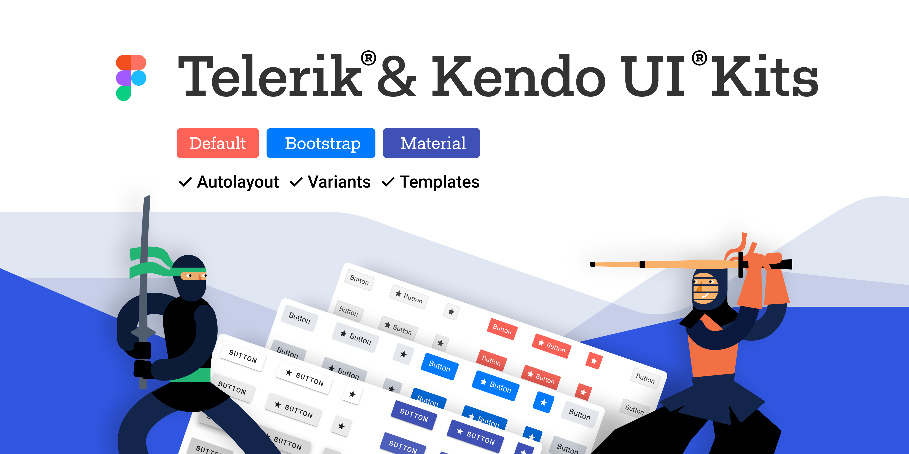

# Telerik and Kendo UI Design Kits for Figma

The [Telerik and Kendo UI design tools for Figma](https://www.figma.com/@progress) are building blocks that match the [Telerik UI for Blazor](https://www.telerik.com/blazor-ui) components.

## Using the UI Kits

The Telerik and Kendo UI Kits for Figma enable efficient collaboration between designers and developers. Each UI kit corresponds to one of the [themes that ship with the Telerik UI for Blazor components](#theme-names).

These polished UI kits include pre-made, reusable design components that follow the [atomic design principles](https://atomicdesign.bradfrost.com/chapter-2/). The design files represent the Telerik UI for Blazor components in every possible state, their detailed anatomy, colors, metrics, and icons. All these elements enable the seamless handover of the design to the developers.

You are free to decide if or how much to customize the UI kits. For example, you can:

* Use them as they are to create application designs.
* Customize the colors in a way that matches your brand guidelines.
* Use them as a starting point for your own component design library or unique design system.

Check the [Figma UI Kits](https://www.telerik.com/design-system/docs/resources/figma-ui-kits/) page on the [Progress Design System documentation](https://www.telerik.com/design-system/docs/) and then visit the [Telerik and Kendo UI design tools for Figma](https://www.figma.com/@progress) home page to get started.

## See Also

* [Built-in Themes]()
* [Custom Themes]()
* [Figma for Developers (blog)](https://www.telerik.com/blogs/figma-developers)
* [Design Systems for Developers (blog)](https://www.telerik.com/blogs/design-systems-developers)
