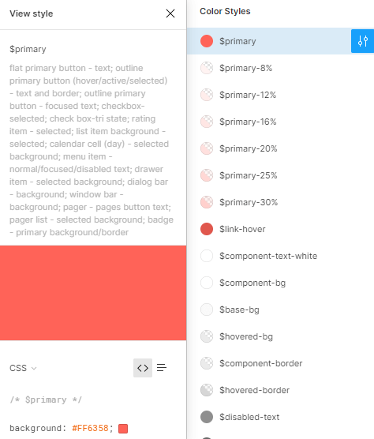

# ThemeBuilder Overview

[ThemeBuilder](https://themebuilderapp.telerik.com) is a web application that enables you to create your custom styles and to apply them to the UI components in your Blazor apps. 

With ThemeBuilder, you can create new themes, customize existing ones, and organize them in projects. You are in full control of the appearance of every Telerik UI for Blazor component while at the same time you can apply large-scale updates in seconds. To speed up the customization of your Blazor app, the ThemeBuilder preview visualizes every style change almost instantly.

> Starting with R3 2022, ThemeBuilder is accessible from a [new URL](https://themebuilderapp.telerik.com). This new ThemeBuilder version replaces the [previous ThemeBuilder](https://themebuilder.telerik.com/), provides more free features, and adds a Pro tier. All your existing custom themes will continue to work in the new ThemeBuilder.

To learn more about using ThemeBuilder, visit the [ThemeBuilder documentation portal](https://docs.telerik.com/themebuilder) where you can learn how to:

* [Create a custom theme](https://docs.telerik.com/themebuilder/get-started/first-steps-theme-builder)
* [Import a JSON file with an existing theme](https://docs.telerik.com/themebuilder/web-app/importing-json)
* [Use a theme in your Blazor app](https://docs.telerik.com/themebuilder/exported-package)

## Implementing Design Requirements

If you work with designers, [ThemeBuilder](https://docs.telerik.com/themebuilder) allows you to style the Telerik UI for Blazor components exactly as required by your application's design and to apply your brand colors.

To improve the collaboration between designers and developers, Telerik UI for Blazor comes with [four UI Kits for Figma](): Material, Bootstrap, Fluent, and Telerik UI Default. Your designers will use them to create the required application design and to apply your brand colors. To implement these design requirements, you need to create a new theme in ThemeBuilder and customize it:

1. Request from the designer to send you a link to the UI kit with the customized colors in Figma.
1. Use the link to open the design in Figma.
   >If you don't have a Figma account, you can create one for free.
1. Navigate to the **Components** page and locate the **Color Styles** in the [Inspect Panel](https://help.figma.com/hc/en-us/articles/360055203533-Use-the-Inspect-panel), where you can find the values of all colors used in the design.

   

1. Create a new project in the ThemeBuilder application. To choose the most suitable starting **Theme**, ask your designer which UI Kit was used: **Default**, **Bootstrap**, **Material**, or **Fluent**.
1. Copy the color codes from the **Color Styles** in Figma and paste them in the ThemeBuilder color editor with the same name. For example, copy the value of the `$primary` color in Figma and paste it in the **Primary** color editor in the ThemeBuilder.

## See Also

* [Progress ThemeBuilder Application](https://themebuilderapp.telerik.com)
* [Progress ThemeBuilder Documentation](https://docs.telerik.com/themebuilder)
