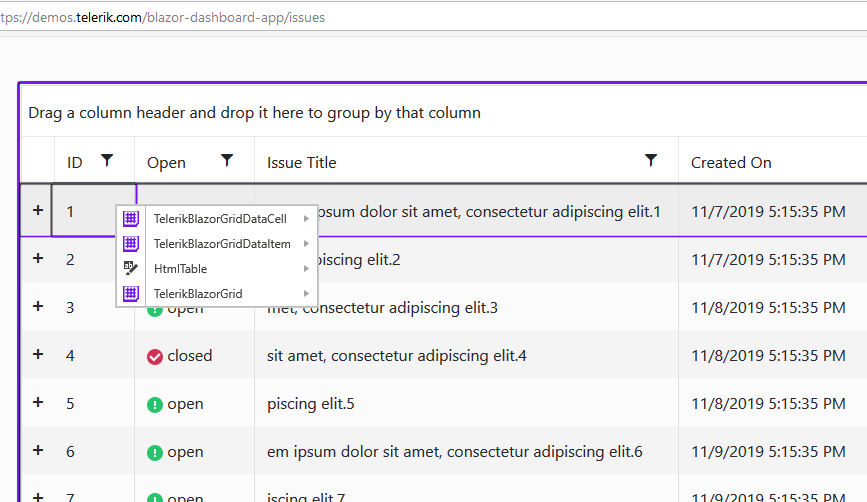

# Testing With Test Studio

[Telerik Test Studio](https://docs.telerik.com/teststudio/) provides [Translators](https://docs.telerik.com/teststudio/general-information/test-recording/translators) for most of the components in the Telerik UI for Blazor suite. You can use them to record UI tests out of the box for your Blazor applications without the need to code.

Translators are extensions that expose internal elements and properties of Telerik controls for automation and verification by Test Studio. First, the translator displays the different elements of the control using Test Studio Hover-Over Highlighting. Selecting one of these elements allows automating against that element from the Elements Menu and Elements Explorer. These tools will expose special properties and actions of these elements of the control, so that tests can take full advantage of the power of Telerik controls.

Test Studio includes translators for the following Telerik UI Blazor components: TreeView, TimePicker, Pager, NumericTextBox, List, Grid, DropdownList, DatePicker, DateInput, Button. The same can be switched on/off from the Project Setting [menu](https://docs.telerik.com/teststudio/features/project-settings/translators):

Test Studio translators would always be up-to-date as Telerik is committed to maintaining them in parallel with Telerik controls changes

Test Studio was built with extensibility in mind, so new translators can be easily plugged in for more UI controls.

## Using Telerik Blazor UI Translators

You need to click `Highlight Element` while in the Test Studio recorder and upon mouse hover on the a given control, first a specific purple color highlight border will appear and then the recording toolbar will show up to indicate more specific translator in progressive order.
The translators for a Grid cell are shown as per the example below, the menu items are:

* TelerikBlazorGridDataCell
* TelerikBlazorGridDataItem
* HTMLTable
* TelerikBlazorGrid

As you mouse over the items in the menu, you can highlight a corresponding element. If you click [Quick Steps](https://docs.telerik.com/teststudio/features/verifications/quick-verification) option to get common tasks being displayed for this element. In the example below, you can see verification, wait and extract tasks for the highlighted Telerik UI for Blazor DropdownList:

## The Translators Advantage

Thanks to the Translators specific variables and tasks for a given UI component, you would save significant amount of time when automating complex scenarios and building the respective verifications.
An example is performing against properties like if the Telerik UI for Blazor Grid is grouped by a given criterion or not:

