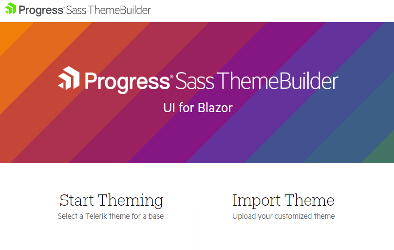
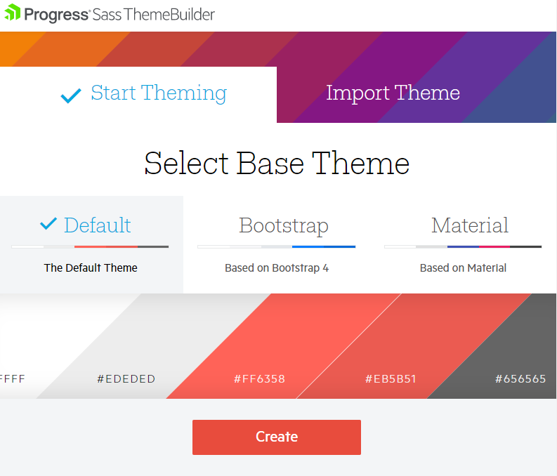
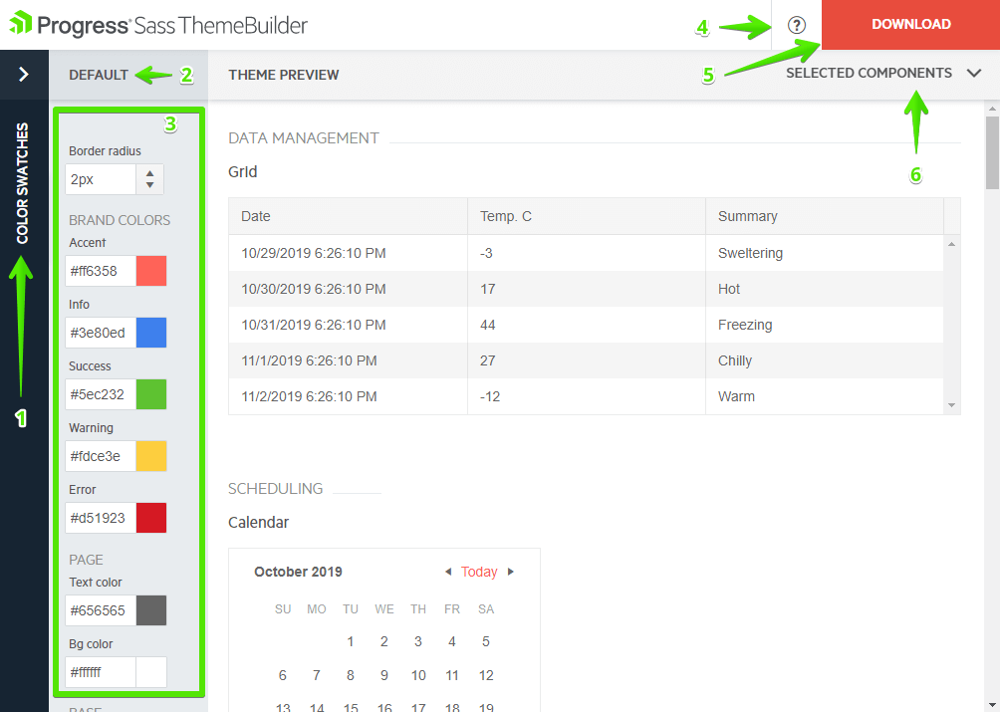
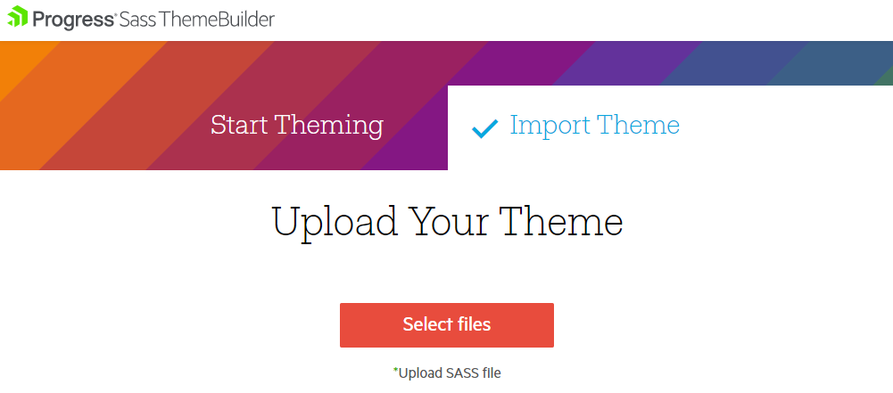

# Custom Themes

By customizing themes you can alter the default appearance of the Telerik components so they match the desired color scheme from your designers and fit with the rest of your site's coloring and style.

This article contains the following sections:

* [Using the Sass Theme Bulder](#using-the-sass-theme-bulder)
	* [Create New Theme](#create-new-theme)
	* [Modifying Themes](#modifying-themes)
	* [Import Custom Theme](#import-custom-theme)
	* [Use The Custom Theme In Your Project](#use-the-custom-theme-in-your-project)
* [Manual Alternative](#manual-alternative)
	* [Using the Build Process of the Application](#using-the-build-process-of-the-application)
	* [Using the Build Process of the Themes](#using-the-build-process-of-the-themes)
	* [Using Variables](#using-variables)
* [Contribution](#contribution)

## Using the Sass Theme Bulder

The Progress [**Sass Theme Builder for Blazor**](https://themebuilder.telerik.com/blazor-ui) is an Angular web application that enables you to create new or customize existing themes.

This article will walk you through the tool and will explain how to use the generated custom theme.

>caption Figure 1: The home screen of the Sass Theme Builder

### Create New Theme

To create a new theme:

1. On the initial Sass Theme Builder pane, select the **Start Theming** option.

1. Choose one of the existing themes to use as a base.

    >caption Figure 2: Selecting a base theme
    
    
    
1. Follow the next options in this article to customize the theme

### Modifying Themes

The Sass Theme Builder supports the following options for customization:

* Color pickers which customize the main aspects of the components' coloring based on your deired color scheme.
    * For the Material theme, there are fewer options as per its guidelines - colors are derived from fewer variables.
* Predefined color swatches - these are predefined color palettes that you can step on. They were chosen by our design team.

The following list describes the Theme Builder UI:

1. Color Swatches pane - expand it to see the available predefined palettes.
2. Base Theme name - the name of the theme you step onto.
3. Color pickers and other controls for customizing the theme.
4. Link to documentation.
5. Download the theme when you are done tweaking, so you can reference it in your project.
6. Components list - you can select which components to include in the preview.

The rest is the Preview pane where you can see the changes in real-time as you make them through the controls on the left.

>caption Figure 3: Theme Builder UI Explained

### Import Custom Theme

You can also upload a theme you have previously worked on:

1. On the initial Sass Theme Builder pane, select **Import Theme**.
1. Upload the `variables.scss` file which contains your current modifications of the customized theme. As a result, the selected components and styling elements load.
1. Start [customizing your theme](#modifying-themes).

>caption Figure 4: Importing themes for customization

### Use The Custom Theme In Your Project

When you complete the modifications and the theme is ready to be used:

1. Download the theme as a compact archive by clicking the **Download** button.
1. Add the `all.css` file to your application. Save the `variables.scss` file for future reference in case you need to re-generate the theme again or customize it further.
1. Include the `all.css` file in the `head` tag of your index document.
    * Make sure that this is the only Telerik Theme that is referenced in the application.
    

## Manual Alternative

Each Kendo UI theme package includes the source files of the respective theme and, thus, provides options for you to modify and rebuild the theme as part of your build process.

For example, you can change the theme colors, remove the CSS of unused components, or use specific theme colors to style your application. The theme source files are located in the scss folder of the theme package.

For the full list of variables that can be modified in a theme, refer to the [Using Variables](#using-variables) section.

To build a custom theme by using the theme variables, apply either of the following approaches:

* [(Recommended) Use the build process of your application](#using-the-build-process-of-the-application)&mdash;This approach simplifies the upgrades to new theme package versions.
* [Use the build process of the themes](#using-the-build-process-of-the-themes)&mdash;This approach requires you to build the theme each time the theme packages are updated.

### Using the Build Process of the Application

To customize a Sass-based theme, create a `.scss` file and consume the theme package in the following way:

1. Obtain the theme source through the NPM package.

        npm install @progress/kendo-theme-default

1. Create a `.scss` file that will consume the theme. For the purposes of the example, this is `styles.scss`.

1. To build the theme files, import them into the `styles.scss` file.

        @import "node_modules/@progress/kendo-theme-default/dist/all.scss";

   The `dist/all` file adds the styles for all components that are available in the theme. To trim down the size of the generated CSS, import only the source for the components that you use in your application. Each of them could be found in `scss/` folder.

        // Import only the Grid and TreeView styles using Node Sass
        @import "~@progress/kendo-theme-default/scss/grid/_index.scss";
        @import "~@progress/kendo-theme-default/scss/treeview/_index.scss";

        // or using Dart Sass
        @import "~@progress/kendo-theme-default/scss/grid/";
        @import "~@progress/kendo-theme-default/scss/treeview/";

1. To customize the variables that are used in the theme, change the theme before you import the theme files.

        $primary: #E82C0C; // brand color

        @import "~@progress/kendo-theme-default/dist/all.scss";

1. Build the `styles.scss` file through a Sass compiler.

    To use Node Sass (which uses [LibSass](https://sass-lang.com/libsass)), install the compiler with `npm install node-sass --save` and then compile the file with the following command

        node-sass styles.scss styles.css

    To use [Dart Sass](https://sass-lang.com/dart-sass), install the compiler with `npm install node-sass@npm:sass --save` and then compile the file with the following command

        sass styles.scss styles.css

### Using the Build Process of the Themes

While each Sass-based theme has a dedicated NPM package (for example, @progress/kendo-theme-default), the source code for all themes is located in the [kendo-themes](https://github.com/telerik/kendo-themes) repository which contains a build task that compiles the theme sources to CSS. To customize a theme, modify the source code of the theme and use the build task to produce a CSS file for your application. This approach avoids the need for a setting up a build configuration when you compile SCSS, but may be harder to maintain as the process has to be repeated each time we update a theme.

You have two options to do that (described in turn below):

* Customizing Themes with Swatches
* Customizing the Source Code

#### Customizing Themes with Swatches

A swatch is a set of variables which customizes the appearance of the theme.

* Each swatch is placed in a separate file. A theme may contain multiple swatches.
* Swatches are useful for creating multiple, persistent theme variations.
* The `.css` output file can be shared across projects and requires no further processing.

To create a swatch:

1. Clone the [kendo-themes](https://github.com/telerik/kendo-themes) GitHub repository.
1. Install the [node-gyp](https://github.com/nodejs/node-gyp#installation) package.
1. Install the dependencies for all themes with `npm install && npx lerna bootstrap`.
1. Switch the working directory to `packages/<THEME_NAME>`.
1. Create a `SWATCH_NAME.scss` swatch file in the `scss/swatches` folder.
1. To build the swatches for the theme by running `npm run sass:swatches` or `npm run dart:swatches`.
1. Include the compiled CSS swatch file in your project. It could be found under `dist/SWATCH_NAME.css`.

For example, in the Material theme create `blue-pink-dark` swatch with the following lines:

    // Variables.
    $primary-palette-name: blue;
    $secondary-palette-name: pink;
    $theme-type: dark;

    // Import the theme file for the components you use.
    @import "../panelbar/_index.scss";
    @import "../grid/_index.scss";

    // Alternatively, include all components.
    @import "../all.scss";

For the Default and Bootstrap themes, the swatch should look like:

    // Variables.
    $primary: blue;
    $secondary: pink;

    // Import the theme file for the components you use.
    @import "../panelbar/_index.scss";
    @import "../grid/_index.scss";

    // Alternatively, include all components.
    @import "../all.scss";

#### Customizing the Source Code

To create a custom theme by modifying the themes source code:

1. Clone the [kendo-themes](https://github.com/telerik/kendo-themes) GitHub repository.
1. Install the dependencies for all themes with `npm install && npx lerna bootstrap`.
1. Customize the theme variables in the `packages/THEME_NAME/scss/_variables.scss` files.
1. Build the themes with the `npm run sass` or `npm run dart` command to create the customized version of the themes in the `packages/THEME_NAME/dist/all.css` file.
1. After the build completes, reference the compiled CSS in your application.

### Using Variables

The following list describes the theme variables available for adjustment in the Kendo UI Default theme.

The following example demonstrates how to use common variables.

<table class="theme-variables">
<colgroup>
<col style="white-space:nowrap; width: 200px" />
<col style="width: 250px" />
<col />
</colgroup>
<tr>
<th>Name</th>
<th>Default value</th>
<th>Description</th>
</tr>
<tr>
<td>$font-size</td>
<td>

    14px
</td>
<td>Base font size across all components.
</td>
</tr>
<tr>
<td>$font-family</td>
<td>

    inherit
</td>
<td>Font family across all components.
</td>
</tr>
<tr>
<td>$font-family-monospace</td>
<td>

    Consolas, "Ubuntu Mono", "Lucida Console", "Courier New", monospace
</td>
<td>Font family for monospaced text. Used for styling the code.
</td>
</tr>
<tr>
<td>$line-height</td>
<td>

    (20 / 14)
</td>
<td>Line height used along with $font-size.
</td>
</tr>
<tr>
<td>$border-radius</td>
<td>

    2px
</td>
<td>Border radius for all components.
</td>
</tr>
<tr>
<td>$accent</td>
<td>
    
    #ff6358
</td>
<td>The color that focuses the user attention. 
Used for primary buttons and for elements of primary importance across the theme.
</td>
</tr>
<tr>
<td>$accent-contrast</td>
<td>
    
    #ffffff
</td>
<td>The color used along with the accent color denoted by $accent. 
Used to provide contrast between the background and foreground colors.
</td>
</tr>
<tr>
<td>$base-text</td>
<td>
    
    #656565
</td>
<td>The text color of the components' chrome area.
</td>
</tr>
<tr>
<td>$base-bg</td>
<td>
    
    #f6f6f6
</td>
<td>The background of the components' chrome area.
</td>
</tr>
<tr>
<td>$base-border</td>
<td>

    rgba( black, .08 )
</td>
<td>The border color of the components' chrome area.
</td>
</tr>
<tr>
<td>$base-gradient</td>
<td>

    $base-bg, darken( $base-bg, 2% )
</td>
<td>The gradient background of the components' chrome area.
</td>
</tr>
<tr>
<td>$hovered-text</td>
<td>
    
    #656565
</td>
<td>The text color of hovered items.
</td>
</tr>
<tr>
<td>$hovered-bg</td>
<td>
    
    #ededed
</td>
<td>The background of hovered items.
</td>
</tr>
<tr>
<td>$hovered-border</td>
<td>

    rgba( black, .15 )
</td>
<td>The border color of hovered items.
</td>
</tr>
<tr>
<td>$hovered-gradient</td>
<td>

    $hovered-bg, darken( $hovered-bg, 2% )
</td>
<td>The gradient background of hovered items.
</td>
</tr>
<tr>
<td>$selected-text</td>
<td>

    $accent-contrast
</td>
<td>The text color of selected items.
</td>
</tr>
<tr>
<td>$selected-bg</td>
<td>

    $accent
</td>
<td>The background of selected items.
</td>
</tr>
<tr>
<td>$selected-border</td>
<td>

    rgba( black, .1 )
</td>
<td>The border color of selected items.
</td>
</tr>
<tr>
<td>$selected-gradient</td>
<td>

    none
</td>
<td>The gradient background of selected items.
</td>
</tr>
<tr>
<td>$error</td>
<td>
    
    #f5503e
</td>
<td>The color for error messages and states.
</td>
</tr>
<tr>
<td>$warning</td>
<td>
    
    #fdce3e
</td>
<td>The color for warning messages and states.
</td>
</tr>
<tr>
<td>$success</td>
<td>
    
    #5ec232
</td>
<td>The color for success messages and states.
</td>
</tr>
<tr>
<td>$info</td>
<td>
    
    #3e80ed
</td>
<td>The color for informational messages and states.
</td>
</tr>
</table>

The following example demonstrates how to configure the Buttons.

<table class="theme-variables">
<colgroup>
<col style="white-space:nowrap; width: 200px" />
<col style="width: 250px" />
<col />
</colgroup>
<tr>
<th>Name</th>
<th>Default value</th>
<th>Description</th>
</tr>
<tr>
<td>$button-text</td>
<td>

    $base-text
</td>
<td>The text color of the buttons.
</td>
</tr>
<tr>
<td>$button-bg</td>
<td>

    $base-bg
</td>
<td>The background of the buttons.
</td>
</tr>
<tr>
<td>$button-border</td>
<td>

    $base-border
</td>
<td>The border color of the buttons.
</td>
</tr>
<tr>
<td>$button-gradient</td>
<td>

    $base-gradient
</td>
<td>The background gradient of the buttons.
</td>
</tr>
<tr>
<td>$button-hovered-text</td>
<td>

    $hovered-text
</td>
<td>The text color of hovered buttons.
</td>
</tr>
<tr>
<td>$button-hovered-bg</td>
<td>

    $hovered-bg
</td>
<td>The background of hovered buttons.
</td>
</tr>
<tr>
<td>$button-hovered-border</td>
<td>

    $hovered-border
</td>
<td>The border color of hovered buttons.
</td>
</tr>
<tr>
<td>$button-hovered-gradient</td>
<td>

    $hovered-gradient
</td>
<td>The background gradient of hovered buttons.
</td>
</tr>
<tr>
<td>$button-pressed-text</td>
<td>

    $selected-text
</td>
<td>The text color of pressed buttons.
</td>
</tr>
<tr>
<td>$button-pressed-bg</td>
<td>

    $selected-bg
</td>
<td>The background color of pressed buttons.
</td>
</tr>
<tr>
<td>$button-pressed-border</td>
<td>

    $selected-border
</td>
<td>The border color of pressed buttons.
</td>
</tr>
<tr>
<td>$button-pressed-gradient</td>
<td>

    none
</td>
<td>The background gradient of pressed buttons.
</td>
</tr>
<tr>
<td>$button-focused-shadow</td>
<td>

    0 3px 4px 0 rgba(0, 0, 0, .06)
</td>
<td>The shadow of focused buttons.
</td>
</tr>
</table>

The following example demonstrates how to configure the Charts.

<table class="theme-variables">
<colgroup>
<col style="white-space:nowrap; width: 200px" />
<col style="width: 250px" />
<col />
</colgroup>
<tr>
<th>Name</th>
<th>Default value</th>
<th>Description</th>
</tr>
<tr>
<td>$series-a</td>
<td>
    
    #ff6358
</td>
<td>The color of the first series.
</td>
</tr>
<tr>
<td>$series-b</td>
<td>
    
    #ffd246
</td>
<td>The color of the second series.
</td>
</tr>
<tr>
<td>$series-c</td>
<td>
    
    #78d237
</td>
<td>The color of the third series.
</td>
</tr>
<tr>
<td>$series-d</td>
<td>
    
    #28b4c8
</td>
<td>The color of the fourth series.
</td>
</tr>
<tr>
<td>$series-e</td>
<td>
    
    #2d73f5
</td>
<td>The color of the fifth series.
</td>
</tr>
<tr>
<td>$series-f</td>
<td>
    
    #aa46be
</td>
<td>The color of the sixth series.
</td>
</tr>
<tr>
<td>$chart-major-lines</td>
<td>

    rgba(0, 0, 0, .08)
</td>
<td>The color of the Chart grid lines (major).
</td>
</tr>
<tr>
<td>$chart-minor-lines</td>
<td>

    rgba(0, 0, 0, .04)
</td>
<td>The color of the Chart grid lines (minor).
</td>
</tr>
</table>

The following example demonstrates how to configure the Toolbar.

<table class="theme-variables">
<colgroup>
<col style="white-space:nowrap; width: 200px" />
<col style="width: 250px" />
<col />
</colgroup>
<tr>
<th>Name</th>
<th>Default value</th>
<th>Description</th>
</tr>
<tr>
<td>$toolbar-padding-x</td>
<td>

    $padding-x
</td>
<td>The horizontal padding of the container.
</td>
</tr>
<tr>
<td>$toolbar-padding-y</td>
<td>

    $padding-x
</td>
<td>The vertical padding of the container.
</td>
</tr>
</table>

## Contribution

To contribute to the development of the Kendo UI Default Theme, refer to the [telerik/kendo-themes](https://github.com/telerik/kendo-themes) GitHub repository it is stored in.

## See Also

  * [Blazor Theme Builder](https://themebuilder.telerik.com/blazor-ui)
  * [Kendo SASS Themes](https://docs.telerik.com/kendo-ui/styles-and-layout/sass-themes)
