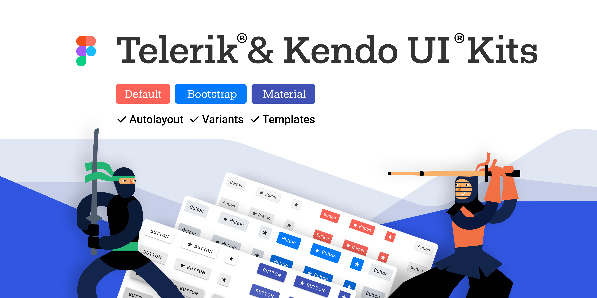
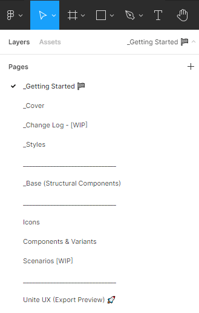
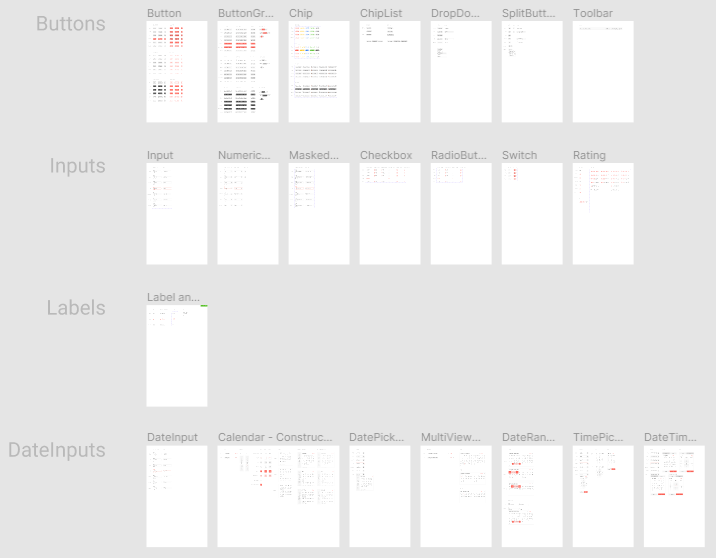

# Telerik UI Design Kits for Figma

Design files for Figma&mdash;building blocks that match the Telerik UI for Blazor components.

To enable efficient collaboration between designers and developers, we created three Telerik UI Kits for Figma: Material, Bootstrap, and Telerik Default. Each kit corresponds to one of the themes that ship with the Telerik UI for Blazor components.

These polished UI kits include pre-made, reusable design components that follow the [atomic design principles](https://atomicdesign.bradfrost.com/chapter-2/).

The design files represent more than 30 of the most used Telerik UI for Blazor components in every possible state, their detailed anatomy, colors, metrics, and icons. All these elements enable the seamless handover of the design to the developers.

You are free to decide if or how much to customize the UI kits:

- You can use them as they are to create application designs.

- You can customize the colors in a way that matches your brand guidelines.

- You can use them as a starting point for your own component design library or unique design system.

## Why Use the Telerik UI Design Kits for Figma?

When you use the UI kits, you enjoy the following advantages:

- You don't need to research the Telerik UI for Blazor components in advance: you don't need to know what components are available, how they are connected, what states they have. The UI kits include all this information.

- You can be sure that the developers will be able to match the Telerik UI for Blazor components with your design requirements.

- You can quickly turn a template into a [shared Figma library](https://www.figma.com/best-practices/components-styles-and-shared-libraries/).

## Downloading the Telerik UI Design Kits

To download a Telerik UI Design Kit for Figma, navigate to the desired kit and follow the instructions on [duplicating a file from the Figma Community](https://help.figma.com/hc/en-us/articles/360038510873-Use-files-from-the-Community#Duplicate).

- [Telerik UI Kit for Material](https://www.figma.com/community/file/971704350762479492)

- [Telerik UI Kit for Bootstrap](https://www.figma.com/community/file/971704996235717509)

- [Telerik UI Kit Default](https://www.figma.com/community/file/971702824494731137)

## Exploring the UI Kits' Structure

The Telerik UI kits for Figma utilize [nested instances and base components](https://www.figma.com/best-practices/creating-and-organizing-variants/using-variants-effectively/) to provide better manageability of the components. To make them more intuitive to use, we added support for [variants](https://help.figma.com/hc/en-us/articles/360055471353-Prepare-for-variants) to some of the components, like the chip.

Each Telerik UI Kit for Figma contains the following pages, most of which provide multiple frames that group similar design assets:

* **_Getting Started**&mdash;Briefly explains what you need to know to start using the UI kits.
* **_Cover**&mdash;The cover page of the UI kit.
* **_Change Log**&mdash;A list with the changes in the UI kit.
* **_Styles**&mdash;An informational page with all styles that are applied to the components such as typography, colors, and effects.
* **_Base (Structural Components)**&mdash;Contains the base components (building blocks). Most of the component states (normal, hover, active, and so on) and component types (for example, solid, flat, and so on) share a common base component. Changes to a base component affect all individual components that use the same base components. For example, if you change the `_Base Button` radius, you will change all button components that nest `_Base Button`.
* **Components & Variants**&mdash;Contains all components with all their variants.
* **Icons**&mdash;Contains all icons in the form of convenient components.
* **Scenarios**&mdash;Contains complex design examples that build upon the components on the **Components & Variants** page and add custom content.
* **Unite UX (Export Preview)**&mdash;The page with the frames that you need to export to [Unite UX](https://docs.telerik.com/unite-ux/introduction). Use this page if you plan to create matching libraries on the design and development sides with Unite UX. 

>tipThe Telerik UI Kits are complex and contain various components with multiple variants and parts. The developers who will use the component design in their apps don't need to know about all variants that are available in the component design library or the design system. That’s why when you export your design to [Unite UX](https://docs.telerik.com/unite-ux/introduction), you must export frames only from the **Unite UX (Export Preview)** and **Icons** pages. This will make the life of the developers easier.
>
>The **Unite UX (Export Preview)** page contains the most essential component instances derived from the **Components & Variants** page. Whenever you update the components on the **Components & Variants** page, the instances on the **Unite UX (Export Preview)** page will also update to reflect your changes.

Most pages contain multiple frames that group similar design assets.

## Customizing a Telerik UI Design Kit

The Telerik UI Kits for Figma are flexible and fully customizable to your vision and needs. Furthermore, the UI kits enable the scalability of the changes that you apply to the design.

To propagate your changes to multiple components and variants, customize the base components on the **_Base (Structural Components)** page or the components on the **Components & Variants** page. If you make changes to the components on the **Unite UX (Export Preview)** page, you change only the instances on that page.

>tip Once you achieve the desired look, you can [publish the modified template as a library](https://help.figma.com/hc/en-us/articles/360041051154#h_b9cf5ead-791e-4ae2-9dd8-aded2fe54fe6).

## Choosing How to Use the UI Kits

Depending on your requirements, you can take advantage of three distinct levels of component customization:

1. Out-of-the-box components&mdash;You can use the UI kits as they are and start creating your application design by selecting [one of the available kits](#downloading-the-telerik-ui-design-kits). This is the fastest solution. Designers enjoy matching building blocks with the developers, seamless handover and implementation of the design.

1. Components with customized colors&mdash;You can modify the UI kits and apply colors that match your brand guidelines. The developers can use the [Theme Builder]() application to transfer the colors from the design to the Telerik UI for Blazor components.

1. Unique design system&mdash;This is the highest possible customization level that has virtually no limits, and you can entirely change the look and feel of the components. You can use the UI kits as a base for your own unique design system. In case you need consultation or help with the implementation, [contact](https://www.telerik.com/services/ui-ux-design) our solution experts who will help you plan, prototype, and build your design system.

## See Also

  * [Built-in Themes]()
  * [Custom Themes]()
  * [Style Form Elements]()