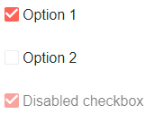

# Styles for Form Elements

The [UI for Blazor Themes]() provide classes that you can use to style elements on the page so they can match the used Telerik Theme.

>tip The UI for Blazor Themes are shared with the Kendo library - you can apply any previous knowledge about Kendo UI products.

This article provides several examples of how you can use the Telerik Themes to style generic elements. These styled generic elements will:

* match the colors and styling of the Telerik components

* look the same across browsers

Select one of the following links to see the example:

* [Checkboxes](#checkboxes)
* [Radio Buttons](#radio-buttons)
* [Inputs (Textboxes)](#inputs-(textboxes))
* [Buttons](#buttons)
* [Cards](#cards)

>note Existing CSS rules in the project may interfere with the applied styles. A common reason is styling from libraries like Bootstrap or rules with low specificity in the site stylesheet. [This blog post](https://www.telerik.com/blogs/improve-your-debugging-skills-with-chrome-devtools) can help you examine the rendering and applied styles so you can troubleshoot any issues.

## Checkboxes

A specific CSS class applied to a `label` element can give you a checkbox that looks the same in all browsers. You still need to provide the actual `input` element, but it will have another CSS class that will hide it visually.

>tip You can use the [TelerikCheckBox]() component instead. It offers a few extra features and events.



>caption Checkboxes with Telerik Theme styling

````HTML
<input type="checkbox" id="cb1" class="k-checkbox" checked="checked">
<label class="k-checkbox-label" for="cb1">Option 1</label>
<br /><br />
<input type="checkbox" id="cb2" class="k-checkbox">
<label class="k-checkbox-label" for="cb2">Option 2</label>
<br /><br />
<input type="checkbox" id="cb3" class="k-checkbox" checked="checked" disabled="disabled">
<label class="k-checkbox-label" for="cb3">Disabled checkbox</label>
````

## Radio Buttons

A specific CSS class applied to a `label` element can give you a radio buttons that look the same in all browsers. You still need to provide the actual `input` element, but it will have another CSS class that will hide it visually.

>note Blazor cannot yet handle binding radio buttons. You can find more details in [this issue](https://github.com/aspnet/AspNetCore/issues/5579).


>caption Radio Buttons with Telerik Theme styling

````HTML
<input type="radio" name="radioButton" id="opt1" class="k-radio" checked="checked">
<label class="k-radio-label" for="opt1">Option 1</label>
<br /><br />
<input type="radio" name="radioButton" id="opt2" class="k-radio">
<label class="k-radio-label" for="opt2">Option 2</label>
<br /><br />
<input type="radio" name="radioButton" id="opt2" class="k-radio" disabled="disabled">
<label class="k-radio-label" for="opt1">Disabled option</label>
````

## Inputs (Textboxes)

You can match standard `input`(`textbox`) elements with the styling of a Telerik component like a numeric textbox.

>tip Telerik provides the majority of necessary inputs - [textbox](../components/textbox/overview), [numeric](../components/numerictextbox/overview) textbox, [date](../components/datepicker/overview) and [time](../components/timepicker/overview) pickers, [password](../components/textbox/overview) input, various [dropdowns](../components/combobox/overview).


>caption Textbox with Telerik Theme styling

````CSHTML
<TelerikTextBox Label="Username:" />
<br /><br />
<input type="password" placeholder="Password:" class="k-textbox" />
````


## Buttons

You can match standard `button` and `a` elements with the styling of a Telerik Button. Note that other CSS rules from libraries like Bootstrap may interfere.


>caption Button with Telerik Theme styling

````HTML
<TelerikButton>Telerik Button</TelerikButton>
<br /><br />
<TelerikButton Primary="true">Primary Telerik Button</TelerikButton>
<br /><br />
<input type="button" value="click me" class="k-button" />
<br /><br />
<input type="button" value="primary button" class="k-button k-primary" />
<br /><br />
<a href="somePage" class="k-button">I am a link</a>
````

## Cards

The Telerik Themes carry styling for card elements. You can read more about them in the [Kendo UI Cards](https://docs.telerik.com/kendo-ui/styles-and-layout/cards) article.

>tip The Cards that Telerik provides styles and sample HTML for can be put into reusable Blazor components in your app where you can define titles and content templates and any other features if needed by your use case and expose them as parameters.

## See Also

  * [Font Icons]()
