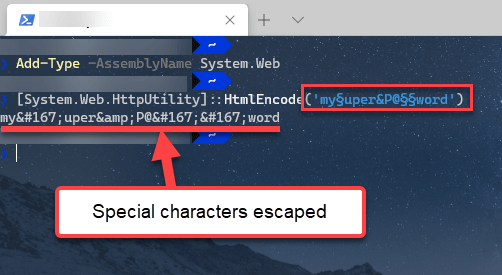

# NuGet Feed Troubleshooting

This article provides ways to fix the most common problems we have had reported with the [setup of the Telerik Online Private NuGet Feed]():

* [I do not see the Telerik Packages](#i-do-not-see-the-telerik-packages)
* [Error 401 Logon failed.](#error-401-login-failed)

## I do not see the Telerik Packages

There are two common reasons for the Telerik packages to be missing in the Telerik Online Feed:

* There is a network issue. For example, a proxy, firewall or other similar software blocks requests to our server.

* Your license is tied to a different account than the one used for the feed credentials.

To check if this is a networking issue, open the following URL in your browser and enter your `telerik.com` credentials: 

<a href="https://nuget.telerik.com/nuget/Search()?$filter=IsAbsoluteLatestVersion&searchTerm=%27Blazor%27&includePrerelease=true&$skip=0&$top=100&semVerLevel=2.0.0" target="_blank">https://nuget.telerik.com/nuget/Search()?$filter=IsAbsoluteLatestVersion&searchTerm=%27Blazor%27&includePrerelease=true&$skip=0&$top=100&semVerLevel=2.0.0</a>

You should see an XML result with the list of packages you can access and you should see the `Telerik.UI.for.Blazor` package with the version appropriate to your license.

If you can access the feed in the browser, but you do not see the packages in Visual Studio, the most likely problem is wrong credentials that are not associated with a license. Make sure that your credentials are correct and that there isn't a `nuget.config` file in the project that is bringing in invalid credentials - project-level config files override the global settings.

I you suspect the credentials are wrong, here is a sample process of removing stored credentials from Windows so you can re-add the correct ones:

1. Remove saved credentials in <a href="https://support.microsoft.com/en-us/help/4026814/windows-accessing-credential-manager" target="_blank">Windows Credential Manager</a>. They will appear as `nuget.telerik.com` and/or `VSCredentials_nuget.telerik.com` entries.
2. Remove the Telerik Nuget package source from Visual Studio.
3. If you have added the Telerik  package source by nuget CLI, then try to remove it from the CLI:
    * <a href="https://docs.microsoft.com/en-us/dotnet/core/tools/dotnet-nuget-list-source" target="_blank">dotnet nuget list source</a> 
    * <a href="https://docs.microsoft.com/en-us/dotnet/core/tools/dotnet-nuget-remove-source" target="_blank">dotnet nuget remove source</a>
4. Check if there are any credentials stored in `%AppData%\NuGet\Nuget.Config` and if so you have to remove them.
5. Try to reset Visual Studio user data. You can read how to do that <a href="https://stackoverflow.com/questions/43550797/how-to-force-nuget-to-ask-for-authentication-when-connecting-to-a-private-feed" target="_blank">here</a>.
6. Restart Visual Studio.
7. Enter the Telerik nuget package source again through Visual Studio or CLI. If you are using the feed in .NET Core application, [store your credentials as plain text](#store-credentials-in-clear-text-for-the-telerik-nuget-feed).


## Error 401 login failed

If your password contains a special character, those characters need to be escaped or it may fail authentication resulting in *Error 401 login failure* from the NuGet server. A common character that needs to be escaped is the ampersand `&`, but it can be as unique as the section character `§`.

### Solutions

1. Change the password so that it only includes characters that do not need to be escaped
2. Escape the special characters before storing it as server credentials. For example, `my§uper&P@§§word` encodes to `my&sect;uper&amp;P@&sect;&sect;word`. 

We **strongly** discourage using a online encoder utility for a password. You can use Powershell command instead, here's one example:

```
Add-Type -AssemblyName System.Web
[System.Web.HttpUtility]::HtmlEncode('my§uper&P@§§word')
```




## See Also

* [Setup of the Telerik Online Private NuGet Feed]()
* [CI, CD, Build Server]()
